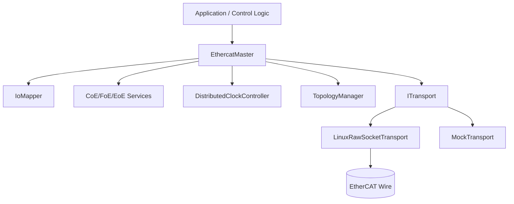
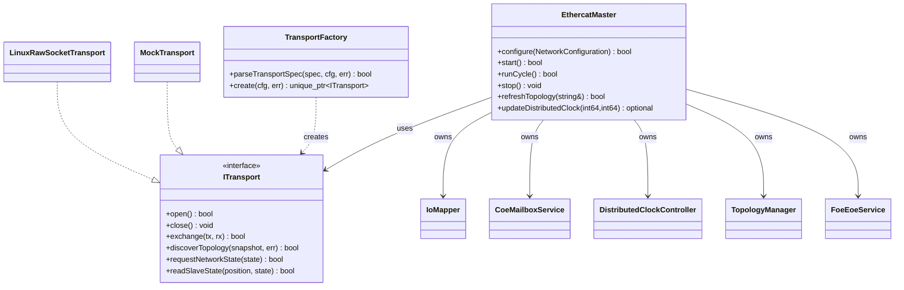
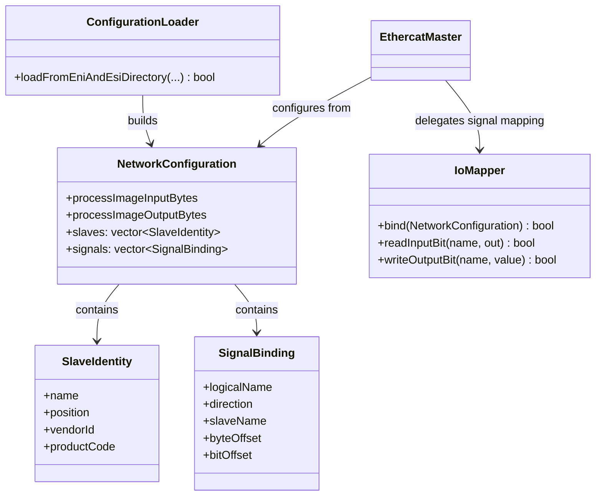
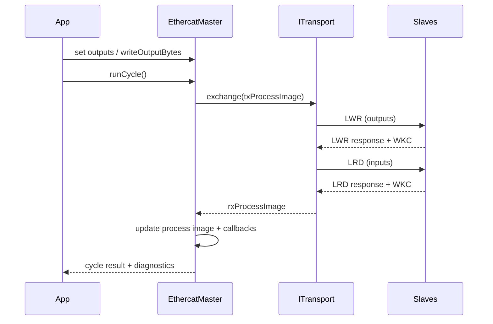
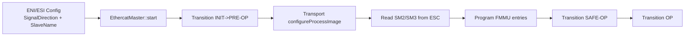
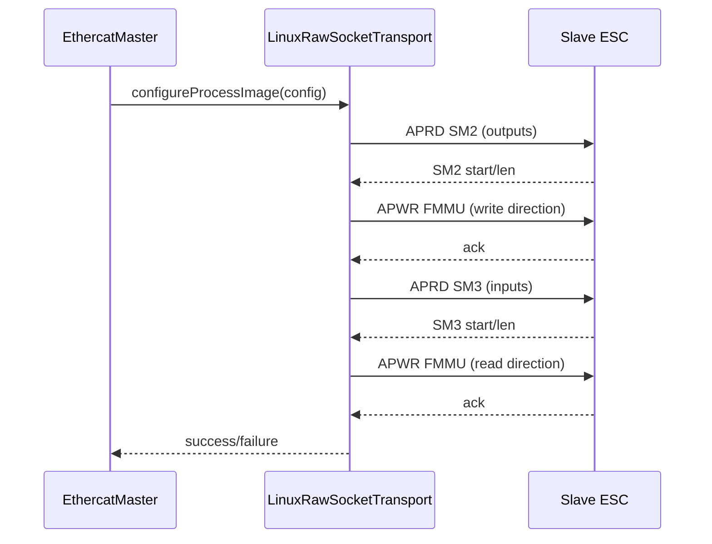
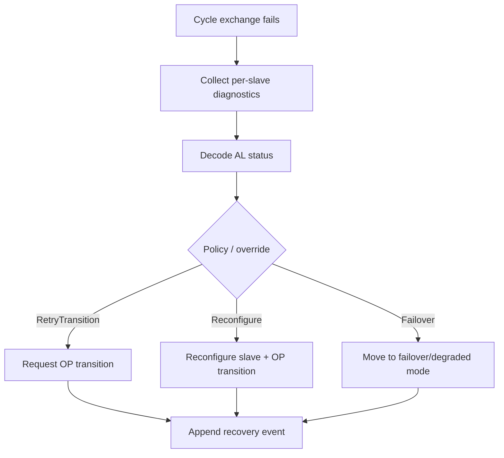

# Architecture

## Layered view



## Core classes and responsibilities

### `oec::EthercatMaster`
- Role: central orchestration facade for applications.
- Owns and coordinates: process image, state transitions, diagnostics, recovery, mailbox service, topology, and distributed clock controller.
- Key responsibilities:
- `configure(...)`: validates and binds ENI/ESI-derived configuration.
- `start()/stop()`: manages transport lifecycle and startup state transitions.
- `runCycle()`: performs cyclic process-data exchange and callback dispatch.
- `onInputChange(...)` and `setOutputByName(...)`: app-level logical signal API.
- `collectSlaveDiagnostics()` and recovery APIs: production monitoring and remediation.

### `oec::ITransport` (abstraction)
- Role: hardware/wire access contract.
- Responsibility boundary:
- Cyclic exchange (`exchange(...)`), network/slave state requests, topology discovery, redundancy health.
- Optional mailbox and protocol hooks (SDO, PDO config, emergency, FoE, EoE).

### `oec::LinuxRawSocketTransport`
- Role: real Linux EtherCAT transport over raw sockets.
- Responsibilities:
- Build/parse EtherCAT datagrams and issue cyclic `LWR` (outputs) + `LRD` (inputs) exchanges.
- Read/write AL state and AL status code registers.
- Discover topology (`discoverTopology(...)`) and report redundancy link health.
- Execute CoE mailbox SDO upload/download paths with strict response matching (address/toggle/mailbox-counter), unrelated-frame filtering, and emergency-frame queueing.

### `oec::MockTransport`
- Role: deterministic non-hardware transport for tests and demos.
- Responsibilities:
- Simulated process-image exchange.
- Fault-injection and deterministic diagnostics/recovery test support.
- Simulated topology, mailbox, FoE/EoE behavior for integration-level tests.

### `oec::TransportFactory`
- Role: runtime transport selection and creation.
- Responsibilities:
- Parse transport specs (`mock`, `linux:eth0`, `linux:eth0,eth1`).
- Create configured `ITransport` instance without app-level coupling to concrete transport classes.

### `oec::IoMapper`
- Role: logical/physical signal mapping layer.
- Responsibilities:
- Resolve signal names to process image location (byte/bit).
- Decouple application semantics from physical slave PDO layout.

### `oec::CoeMailboxService`
- Role: CoE service facade exposed by master.
- Responsibilities:
- SDO upload/download service calls.
- PDO assignment/configuration helpers.
- Emergency queue drain API.

### `oec::DistributedClockController`
- Role: cyclic DC correction and timing quality monitoring.
- Responsibilities:
- Compute correction term from reference/local time observations.
- Track jitter/offset statistics for control-loop observability.

### `oec::TopologyManager`
- Role: transport-backed topology state manager.
- Responsibilities:
- Refresh bus snapshot from transport discovery hooks.
- Detect hot-connected and missing slaves relative to configured expectation.

### `oec::SlaveDiagnostics` and recovery policy components
- Role: normalize per-slave health and recovery decisioning.
- Responsibilities:
- Decode AL status/error register context into actionable diagnostic records.
- Execute retry/reconfigure/failover policy actions and record events.

## Class diagram (high level)



## Class diagram (configuration and mapping)



## Cyclic runtime sequence



## Linux PDO mapping model (current)

Current Linux startup mapping is hybrid:
- Logical signal intent comes from configuration (`NetworkConfiguration`).
- Sync manager base/length (`SM2` for outputs, `SM3` for inputs) is read from each slave ESC at startup.
- FMMU entries are programmed from those SM windows to the master's logical process image.
- Full dynamic PDO descriptor discovery (`0x1C12/0x1C13`, `0x16xx/0x1Axx`) is not yet auto-derived.
- Optional runtime write-verification can read back SM2 process RAM and compare against commanded outputs (`OEC_TRACE_OUTPUT_VERIFY=1`).





## Recovery decision flow



## Usage snippets

### 1) Runtime-selectable transport and master startup

```cpp
#include "openethercat/config/config_loader.hpp"
#include "openethercat/master/ethercat_master.hpp"
#include "openethercat/transport/transport_factory.hpp"

oec::NetworkConfiguration cfg;
std::string error;
oec::ConfigurationLoader::loadFromEniAndEsiDirectory(
    "examples/config/beckhoff_demo.eni.xml", "examples/config", cfg, error);

oec::TransportFactoryConfig tc;
tc.mockInputBytes = cfg.processImageInputBytes;
tc.mockOutputBytes = cfg.processImageOutputBytes;
oec::TransportFactory::parseTransportSpec("linux:eth0", tc, error);
auto transport = oec::TransportFactory::create(tc, error);

oec::EthercatMaster master(*transport);
master.configure(cfg);
master.start();
```

### 2) Logical callback + logical output write

```cpp
master.onInputChange("StartButton", [&](bool state) {
    master.setOutputByName("LampGreen", state);
});

while (true) {
    if (!master.runCycle()) {
        break; // inspect master.lastError()
    }
}
```

### 3) Physical topology scan (no process-data mapping required)

```cpp
oec::TransportFactoryConfig tc;
std::string error;
oec::TransportFactory::parseTransportSpec("linux:eth0", tc, error);
auto transport = oec::TransportFactory::create(tc, error);
transport->open();

oec::TopologyManager topology(*transport);
topology.refresh(error);
auto snap = topology.snapshot();
for (const auto& slave : snap.slaves) {
    // slave.position, slave.vendorId, slave.productCode, slave.online
}
transport->close();
```

### 4) CoE SDO usage from master

```cpp
const auto wr = master.sdoDownload(2, {.index = 0x2000, .subIndex = 1}, {0x11, 0x22});
const auto rd = master.sdoUpload(2, {.index = 0x2000, .subIndex = 1});
if (!wr.success || !rd.success) {
    // wr.error / rd.error
}
```
