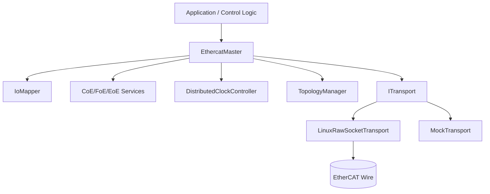
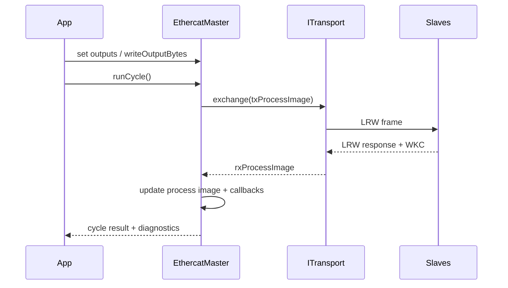
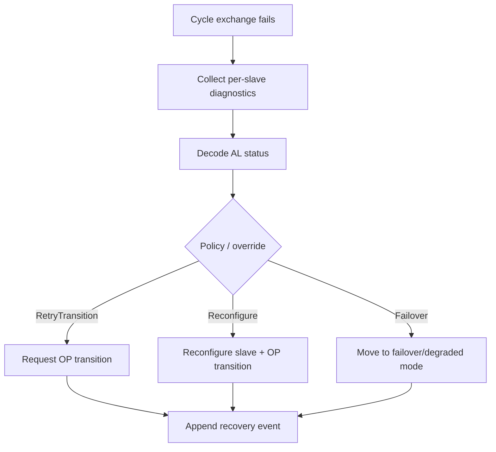

# Architecture

## Layered view

```mermaid
flowchart TB
    App[Application / Control Logic]
    Master[EthercatMaster]
    Mapper[IoMapper]
    Mailbox[CoE/FoE/EoE Services]
    DC[DistributedClockController]
    Topology[TopologyManager]
    Transport[ITransport]
    Linux[LinuxRawSocketTransport]
    Mock[MockTransport]
    Wire[(EtherCAT Wire)]

    App --> Master
    Master --> Mapper
    Master --> Mailbox
    Master --> DC
    Master --> Topology
    Master --> Transport
    Transport --> Linux
    Transport --> Mock
    Linux --> Wire
```

## Cyclic runtime sequence

```mermaid
sequenceDiagram
    participant APP as App
    participant M as EthercatMaster
    participant T as ITransport
    participant S as Slaves

    APP->>M: set outputs / writeOutputBytes
    APP->>M: runCycle()
    M->>T: exchange(txProcessImage)
    T->>S: LRW frame
    S-->>T: LRW response + WKC
    T-->>M: rxProcessImage
    M->>M: update process image + callbacks
    M-->>APP: cycle result + diagnostics
```

## Recovery decision flow

```mermaid
flowchart TD
    CycleFail[Cycle exchange fails] --> Diag[Collect per-slave diagnostics]
    Diag --> Decode[Decode AL status]
    Decode --> Policy{Policy / override}
    Policy -->|RetryTransition| Retry[Request OP transition]
    Policy -->|Reconfigure| Reconf[Reconfigure slave + OP transition]
    Policy -->|Failover| Failover[Move to failover/degraded mode]
    Retry --> Event[Append recovery event]
    Reconf --> Event
    Failover --> Event
```
