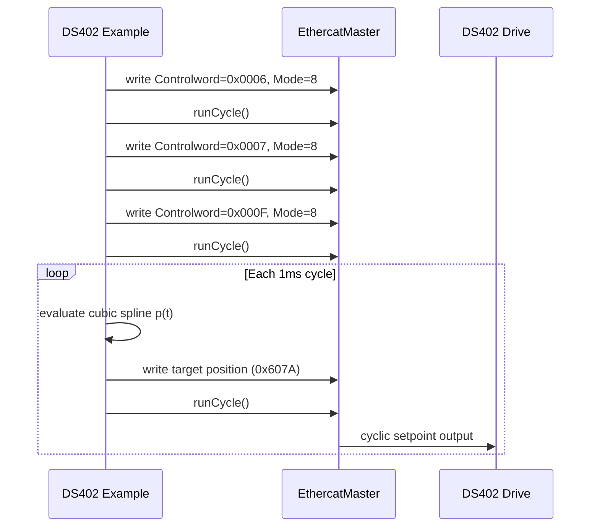

# DS402 Cubic Trajectory Example

This document describes `examples/ds402_cubic_trajectory_demo.cpp`.

## Goal

Drive a CiA DS402 compliant axis from position A to B using a cubic spline trajectory in cyclic synchronous position mode (CSP), and stream setpoints cyclically through the EtherCAT master output process image.

## Data mapping in the example

Output process image layout:

- Bytes `0..1`: Controlword (`0x6040`)
- Bytes `2..5`: Target position (`0x607A`)
- Byte `6`: Mode of operation (`0x6060`, set to CSP `8`)

## Sequence

## Cubic spline model

The example uses a standard 1D cubic polynomial with boundary constraints:

- `p(0)=p0`
- `p(T)=p1`
- `p'(0)=v0`
- `p'(T)=v1`

This gives smooth position interpolation and zero endpoint velocities in the provided demo.

## Notes for real drives

- Real DS402 commissioning requires full statusword-driven state-machine handling.
- CSP usually expects synchronized cycle timing and distributed clock discipline.
- Safety limits (velocity, acceleration, software limits, watchdog behavior) must be validated on target hardware.
