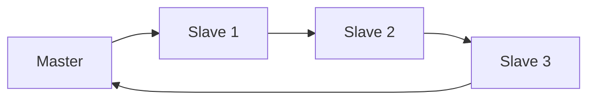
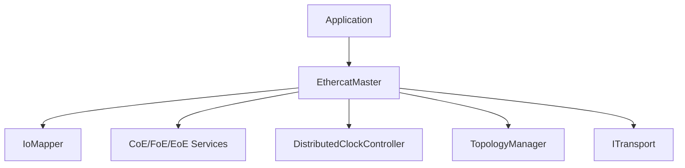
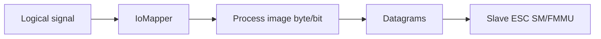
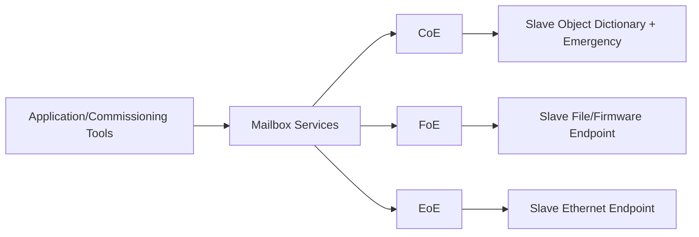
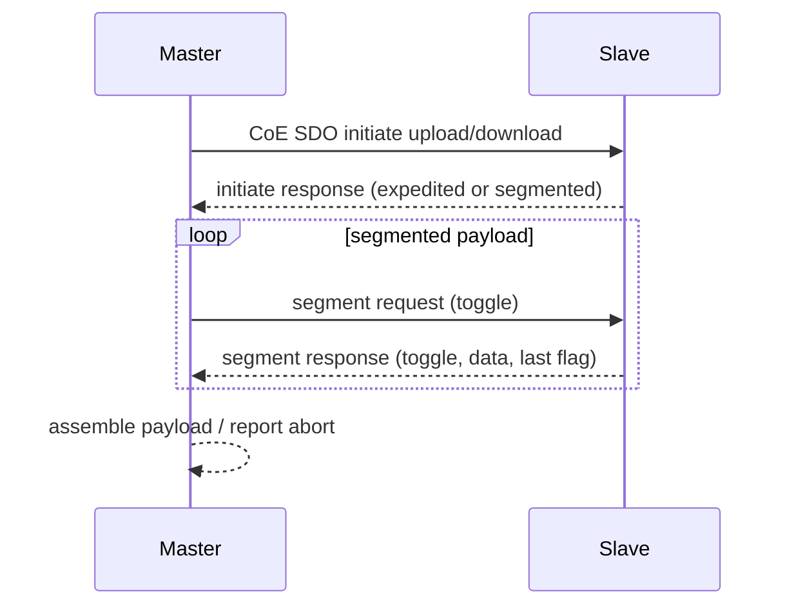
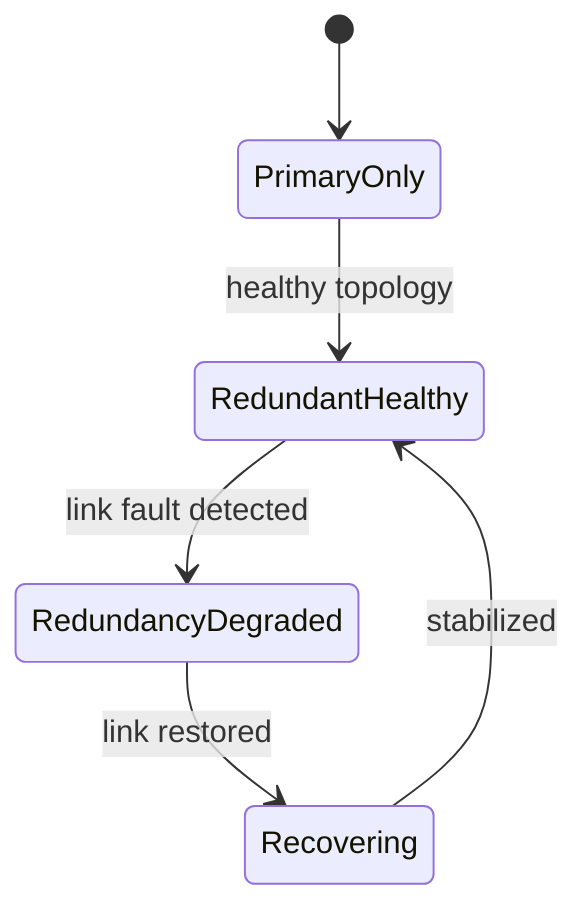

# EtherCAT for Dummies

Practical technical guide to understanding EtherCAT technology and how it maps to this openEtherCAT stack.

## Who this is for

- Software engineers building industrial communication and control software.
- Automation engineers doing EtherCAT bring-up and diagnostics.
- Anyone using this repository who wants a full protocol-to-code mental model.

## How to read this book

- Read Chapters 1-5 first if you are new to EtherCAT.
- Jump to Chapters 6-10 for implementation details.
- Use Chapters 11-13 as a bring-up and troubleshooting handbook.

---

## Chapter 1: What EtherCAT Is (and Why It Is Fast)

EtherCAT is an Ethernet-based fieldbus optimized for deterministic cyclic I/O. Its speed comes from "on-the-fly" frame processing:

- Master emits an Ethernet frame carrying EtherCAT datagrams.
- Each slave reads/writes only its mapped bytes while forwarding the frame immediately.
- The frame returns with all slave data already embedded.

This avoids per-slave request/response round trips.

### Conceptual comparison

- Traditional polling bus:
  - `Master -> Slave1`, wait, `Master -> Slave2`, wait, ...
- EtherCAT:
  - single frame traverses full line, all nodes participate in one pass.



### Determinism perspective

Determinism is achieved by combining:

- predictable cyclic scheduling on master,
- fixed process image layout,
- strict state-machine transitions,
- per-cycle datagram acknowledgements (WKC),
- optional distributed clock synchronization.

---

## Chapter 2: EtherCAT Protocol Building Blocks

At wire level, this stack uses EtherType `0x88A4` (EtherCAT Ethernet frames).

Inside an EtherCAT frame are one or more datagrams. Key commands used in this stack:

- `LWR` logical write: master writes output process image.
- `LRD` logical read: master reads input process image.
- `APRD` auto-increment physical read: read slave ESC registers/memory by station position.
- `APWR` auto-increment physical write: write slave ESC registers/memory.
- `BRD/BWR` broadcast read/write: network-wide state operations.

### Why both logical and physical access exist

- Logical access (`LWR/LRD`): high-rate cyclic process data path.
- Physical access (`APRD/APWR`): startup, diagnostics, SM/FMMU setup, AL state/status readouts.

---

## Chapter 3: Master Architecture in This Stack

`oec::EthercatMaster` is the central facade. It coordinates:

- configuration validation and mapping binding,
- startup AL transitions,
- cyclic exchange,
- mailbox services,
- diagnostics and recovery,
- distributed clocks,
- topology/redundancy supervision.



### Startup sequence (high level)

1. `configure(config)`:
- validates process image sizes and logical bindings.

2. `start()`:
- opens transport,
- transitions network through AL states,
- configures process image mapping,
- transitions to OP.

### Cyclic sequence (high level)

1. application updates outputs,
2. `runCycle()` calls transport `exchange(...)`,
3. transport performs `LWR` then `LRD`,
4. master updates input image and dispatches callbacks,
5. monitoring/policy layers may run (DC, topology, recovery).

---

## Chapter 4: Inside a Slave (ESC, AL, SM, FMMU)

A slave has an ESC (EtherCAT Slave Controller). Think of ESC as a real-time packet processor + register block.

## 4.1 AL state machine

- `INIT`: baseline initialization.
- `PRE-OP`: mailbox communication available, process data typically not active.
- `SAFE-OP`: inputs valid, outputs may be held safe.
- `OP`: full cyclic process data active.
- `BOOTSTRAP`: firmware/bootstrap mode for specialized workflows.

## 4.2 Sync Managers (SM)

SMs define memory windows and direction:

- `SM2`: usually RxPDO area (master -> slave outputs).
- `SM3`: usually TxPDO area (slave -> master inputs).

If `SM2` or `SM3` lengths are zero, PDO path may not be mapped/active.

## 4.3 FMMU

FMMU maps logical EtherCAT addresses to slave physical process RAM windows.

Practical meaning:

- Master writes logical output region.
- ESC routes to the corresponding slave output RAM area.
- Master reads logical input region.
- ESC exposes current slave input RAM area.

Without valid SM+FMMU setup, cyclic IO appears broken even if wiring is correct.

---

## Chapter 5: Process Image and Logical Mapping

Process image is the contract between control application and field bus.

- Output process image: commanded outputs.
- Input process image: measured inputs.

In this stack, logical app signals are mapped by `IoMapper`:

- `logicalName` + direction + byte/bit offsets.

### Example mapping

- `StartButton` -> input byte 0 bit N.
- `LampGreen` -> output byte 0 bit N.

Same app code can be reused across hardware changes by updating mapping, not control logic.



---

## Chapter 6: Working Counter (WKC) Correct Interpretation

WKC indicates how many addressed slave operations were accepted for a datagram.

Critical point: WKC is datagram-specific.

In this stack:

- `wkc_lwr`: WKC for output write (`LWR`).
- `wkc_lrd`: WKC for input read (`LRD`).
- `wkc_sum`: convenience sum for quick view.

### Why `wkc=1` can be correct with multiple slaves

If only one output slave participates in mapped output window and one input slave in mapped input window:

- `wkc_lwr=1`, `wkc_lrd=1` can be perfectly valid.

A coupler (e.g., EK1100) may not increment cyclic PDO WKC unless it participates in that logical datagram operation.

### Failure heuristics

- `wkc_lwr=0`: output mapping/path/state issue.
- `wkc_lrd=0`: input mapping/path/state issue.
- intermittent drops: wiring/noise/link/load/scheduling issues.

---

## Chapter 7: Mailbox Plane (CoE, FoE, EoE)

Mailbox traffic is the acyclic control/service plane of EtherCAT. It runs alongside cyclic PDO traffic and is used for configuration, diagnostics, firmware/file operations, and tunneled Ethernet services.

At a high level:

- `CoE` (CANopen over EtherCAT): object dictionary access and control services.
- `FoE` (File over EtherCAT): file-oriented transfer protocol (often firmware/config blobs).
- `EoE` (Ethernet over EtherCAT): encapsulated Ethernet frames through the EtherCAT line.



### 7.1 Mailbox service model in this stack

Public API surface on `EthercatMaster`:

- CoE:
  - `sdoUpload(...)`, `sdoDownload(...)`
  - `configureRxPdo(...)`, `configureTxPdo(...)`
  - `drainEmergencies(...)`
- FoE:
  - `foeReadFile(...)`, `foeWriteFile(...)`
- EoE:
  - `eoeSendFrame(...)`, `eoeReceiveFrame(...)`

Implementation layering:

- `EthercatMaster` delegates to:
  - `CoeMailboxService`
  - `FoeEoeService`
- Services delegate to `ITransport` mailbox hooks.
- Linux raw-socket transport currently has complete CoE SDO path; FoE/EoE wire path is not yet complete there.

### 7.2 CoE in depth (object dictionary services)

CoE is the most important mailbox protocol for runtime setup and diagnostics.

Core functions:

- SDO upload/download (read/write object dictionary entries),
- PDO assignment and mapping programming (`0x1C12`, `0x1C13`, `0x16xx`, `0x1Axx`),
- emergency object delivery.

SDO transfer modes (protocol concept):

- Expedited transfer: small payload embedded directly in response/request.
- Segmented transfer: multi-frame payload with toggle-bit progression and end flag.

In this stack (Linux transport):

- Segmented upload/download is implemented in `linux_raw_socket_transport.cpp`.
- Response matching uses mailbox counter + CoE/SDO context checks.
- Unrelated frames are ignored during wait loops.
- Emergency frames observed during SDO waits are decoded and queued.

Example: SDO read/write using master facade

```cpp
const auto wr = master.sdoDownload(2, {.index = 0x2000, .subIndex = 1}, {0x11, 0x22});
if (!wr.success) {
    // wr.abort may contain SDO abort details
}

const auto rd = master.sdoUpload(2, {.index = 0x2000, .subIndex = 1});
if (rd.success && rd.data.size() >= 2) {
    // interpret rd.data
}
```

Example: consume emergency queue

```cpp
for (const auto& emcy : master.drainEmergencies(32)) {
    // emcy.errorCode, emcy.errorRegister, emcy.manufacturerData, emcy.slavePosition
}
```

Conceptual segmented CoE transfer sequence:



### 7.3 CoE robustness, diagnostics, and tuning knobs

Implemented hardening behavior:

- mailbox status mode (`strict`, `hybrid`, `poll`),
- retry with bounded exponential backoff,
- stale mailbox counter drop protection,
- parse-reject accounting,
- abort-code reporting for SDO failures,
- emergency queue bounds with drop counters.

Useful runtime knobs:

- `OEC_MAILBOX_STATUS_MODE=strict|hybrid|poll`
- `OEC_MAILBOX_RETRIES=<N>`
- `OEC_MAILBOX_BACKOFF_BASE_MS=<ms>`
- `OEC_MAILBOX_BACKOFF_MAX_MS=<ms>`
- `OEC_MAILBOX_EMERGENCY_QUEUE_LIMIT=<N>`

Telemetry/KPI path:

- `mailbox_soak_demo` prints mailbox diagnostics counters and supports JSON lines (`OEC_SOAK_JSON=1`) for long-run analysis.

### 7.4 PDO mapping and PDO reconfiguration (general EtherCAT behavior)

PDO mapping is defined through object dictionary entries.

Typical CANopen-over-EtherCAT layout:

- RxPDO mapping objects: `0x1600...`
- TxPDO mapping objects: `0x1A00...`
- RxPDO assignment object: `0x1C12`
- TxPDO assignment object: `0x1C13`

Mapping entry format (32-bit):

- bits `15..0`: object index
- bits `23..16`: subindex
- bits `31..24`: bit length

Standard reconfiguration pattern (conceptual):

1. Move slave to a safe configuration state (typically PRE-OP/SAFE-OP context).
2. Disable assignment count (`sub0 = 0`) for mapping object.
3. Write mapping entries to subindices `1..N`.
4. Write mapping object `sub0 = N`.
5. Disable SM assignment object `sub0 = 0`.
6. Assign mapping object index at `sub1`.
7. Re-enable SM assignment object `sub0 = 1` (or more, if multiple PDO objects).
8. Return to operational state and validate WKC/process data behavior.

Why this order matters:

- Writing mappings while assignment is active can fail or create transient inconsistency.
- Many slaves enforce strict state and sequencing requirements.

### 7.5 PDO mapping in this stack (current implementation)

Public master API:

- `configureRxPdo(slavePos, entries, err)`
- `configureTxPdo(slavePos, entries, err)`

`PdoMappingEntry` fields:

- `index`
- `subIndex`
- `bitLength`

Current transport behavior (`LinuxRawSocketTransport::configurePdo`):

1. Writes mapping object (`0x1600` for Rx, `0x1A00` for Tx in current helper flow):
   - set `sub0=0`,
   - write entries (`sub1..`),
   - set `sub0=entryCount`.
2. Writes assignment object:
   - Rx path uses `0x1C12`,
   - Tx path uses `0x1C13`,
   - set `sub0=0`, set `sub1=<mapIndex>`, set `sub0=1`.

Important current scope:

- Helper path uses first standard objects (`0x1600`, `0x1A00`) by default.
- Full auto-derivation across arbitrary multi-PDO maps and vendor-specific layouts is not yet complete.
- Some simple digital terminals do not require mailbox PDO remapping for basic cyclic IO and rely on fixed SM/FMMU process RAM mapping.

### 7.6 Example: configure one RxPDO and one TxPDO

```cpp
std::string err;
std::vector<oec::PdoMappingEntry> rx = {
    {.index = 0x7000, .subIndex = 0x01, .bitLength = 8},
};
std::vector<oec::PdoMappingEntry> tx = {
    {.index = 0x6000, .subIndex = 0x01, .bitLength = 8},
};

if (!master.configureRxPdo(2, rx, err)) {
    // inspect err
}
if (!master.configureTxPdo(2, tx, err)) {
    // inspect err
}
```

### 7.7 FoE in depth (file transfer semantics)

FoE is designed for file-style transfers to/from slaves, commonly used for:

- firmware images,
- device parameter files,
- boot-time artifacts.

Stack API:

```cpp
oec::FoERequest req;
req.fileName = "firmware.bin";
req.password = 0;
req.maxChunkBytes = 1024;

auto readRsp = master.foeReadFile(3, req);
if (!readRsp.success) {
    // readRsp.error
}

std::string err;
std::vector<std::uint8_t> image{/* ... */};
if (!master.foeWriteFile(3, req, image, err)) {
    // err
}
```

Current implementation status:

- Mock transport: FoE read/write paths are available for integration testing.
- Linux raw-socket transport: FoE wire integration is not yet complete and currently returns a clear "pending full ESC mailbox integration" error.

### 7.8 EoE in depth (Ethernet tunneling)

EoE tunnels Ethernet frames through EtherCAT mailbox channels, enabling communication with Ethernet-capable slave endpoints.

Typical use cases:

- commissioning traffic to embedded device Ethernet stacks,
- diagnostics protocols that require Ethernet framing,
- segregated maintenance channels.

Stack API:

```cpp
std::vector<std::uint8_t> txFrame{/* raw Ethernet frame bytes */};
std::string err;
if (!master.eoeSendFrame(3, txFrame, err)) {
    // err
}

std::vector<std::uint8_t> rxFrame;
if (master.eoeReceiveFrame(3, rxFrame, err)) {
    // parse Ethernet frame
}
```

Current implementation status:

- Mock transport: EoE send/receive is available for behavior testing.
- Linux raw-socket transport: EoE wire integration is not yet complete and currently reports pending support.

### 7.9 Practical caution for reconfiguration and service traffic

- Reconfigure PDOs when the slave is not in full OP data exchange unless vendor docs explicitly allow it.
- After PDO changes:
  - refresh/rebuild process image mapping as needed,
  - verify `SM2/SM3` lengths,
  - verify `LWR/LRD` WKC and actual field IO behavior.
- Keep mailbox traffic bounded in runtime-critical loops; uncontrolled acyclic bursts can perturb deterministic cycle budgets on constrained CPUs.

---

## Chapter 8: Distributed Clocks (DC) and Time Quality

Distributed clocks synchronize timing reference across slaves and master control loop.

### 8.1 What DC solves

Without DC, each slave and the host scheduler run on independent clocks. Over time this creates phase drift:

- outputs are applied with varying phase relative to task cycle,
- input sampling phase moves,
- control loops experience jitter/noise not caused by the plant.

DC provides a common notion of time and lets the master align cyclic execution to that timebase.

### 8.2 Practical DC time model

Define:

- `Tref`: reference DC time (typically selected slave clock),
- `Thost`: host time used by the cyclic controller,
- phase error `e = Tref - Thost`.

In this stack, correction is computed from filtered phase error:

- `e_f(k) = (1-a)*e_f(k-1) + a*e(k)` where `a = filterAlpha`
- PI output `u(k) = Kp*e_f(k) + Ki*sum(e_f)`
- output clamped and slew-limited before writing offset.

Why clamping/slew matters:

- prevents large abrupt offset jumps,
- avoids control chatter when clock noise spikes,
- protects against unstable tuning on slower CPUs/NIC paths.

### 8.3 DC register path in this stack

Linux transport currently uses per-slave DC register read/write primitives:

- read DC system time,
- write DC system time offset.

These are used by:

- `dc_hardware_sync_demo` (focused loop),
- optional in-master closed loop in `runCycle()` when enabled.

Current scope note:

- this is a practical hardware prototype path,
- not yet a full hardware-wired Sync0/Sync1 phase-control implementation with NIC timestamp coupling.

### 8.4 Closed-loop integration in `EthercatMaster`

When `OEC_DC_CLOSED_LOOP=1`, each cycle can do:

1. read reference slave DC time,
2. compute phase error using host steady clock (+ optional target phase),
3. run PI controller,
4. apply correction limits,
5. write DC offset,
6. update sync quality monitor.

This couples DC behavior directly to your cyclic master loop, which is where control determinism matters.

### 8.5 Sync quality supervision

The stack tracks quality beyond raw correction:

- in-window / out-of-window phase error counters,
- lock acquisition and lock loss counts,
- rolling jitter percentiles (`p50/p95/p99/max`),
- policy triggers (`warn`, `degrade`, `recover`).

This turns DC from a black box into a measurable control subsystem.

### 8.6 Tuning strategy (field-proven workflow)

1. Start conservative:
- low `Kp`, very low `Ki`,
- modest clamp/slew limits.

2. Observe:
- `phase_err_ns`,
- `jitter_p99_ns`,
- lock stability,
- policy trigger frequency.

3. Increase gains gradually:
- improve convergence without oscillation.

4. Tighten limits:
- only after stable lock across long soaks.

Bad tuning signatures:

- alternating large positive/negative corrections,
- repeated lock loss and re-acquire,
- rising policy triggers with no cable faults.

### 8.7 Runtime knobs (selected)

- `OEC_DC_CLOSED_LOOP=1`
- `OEC_DC_REFERENCE_SLAVE=<pos>`
- `OEC_DC_TARGET_PHASE_NS=<ns>`
- `OEC_DC_FILTER_ALPHA=<0..1>`
- `OEC_DC_KP=<gain>`
- `OEC_DC_KI=<gain>`
- `OEC_DC_CORRECTION_CLAMP_NS=<ns>`
- `OEC_DC_MAX_CORR_STEP_NS=<ns>`
- `OEC_DC_MAX_SLEW_NS=<ns>`
- `OEC_DC_SYNC_MONITOR=1`
- `OEC_DC_SYNC_MAX_PHASE_ERROR_NS=<ns>`
- `OEC_DC_SYNC_LOCK_ACQUIRE_CYCLES=<N>`
- `OEC_DC_SYNC_MAX_OOW_CYCLES=<N>`
- `OEC_DC_SYNC_HISTORY_WINDOW=<N>`
- `OEC_DC_SYNC_ACTION=warn|degrade|recover`
- `OEC_TRACE_DC=1`

### 8.8 KPI interpretation for acceptance

Use `dc_soak_demo` and monitor:

- `runtime_p99_us`: scheduler and runtime health,
- `wake_jitter_p99_ns`: host wakeup quality,
- `dc_jitter_p99_ns`: DC phase stability,
- `lock_duty`: fraction of cycles in locked state,
- `dc_policy_triggers`: supervision action frequency.

You want stable low tails and near-continuous lock in target operating conditions.

### 8.9 Relevant demos

- `dc_hardware_sync_demo`: low-level DC register/control behavior.
- `dc_soak_demo`: long-run KPI collection with JSON output.
- `beckhoff_io_demo` + `OEC_TRACE_DC_QUALITY=1`: integrated cyclic path view.

---

## Chapter 9: Topology Reconciliation and Change Sets

Topology is not static in production: cable faults, module swaps, power cycles, hot-connect events can happen.

This stack provides deterministic topology snapshots and deltas:

- `topologySnapshot()`
- `topologyChangeSet()`
- `topologyGeneration()`

Change set fields capture:

- `added` slaves,
- `removed` slaves,
- `updated` slave properties/state,
- redundancy health transition.

Generation gives monotonic ordering and easier event correlation.

---

## Chapter 10: Topology Policy and Redundancy Supervision

Beyond detection, production systems need policy execution.

`TopologyRecoveryOptions` supports:

- grace cycles (debounce/noise filtering),
- per-condition actions:
  - `Monitor`
  - `Retry`
  - `Reconfigure`
  - `Degrade`
  - `FailStop`

Conditions include:

- missing expected slaves,
- unexpected hot-connected slaves,
- redundancy down state.

### Redundancy states in this stack

- `PrimaryOnly`
- `RedundantHealthy`
- `RedundancyDegraded`
- `Recovering`



### Observability APIs

- `redundancyStatus()`
- `redundancyKpis()`
- `redundancyTransitions()` (timeline events)

---

## Chapter 11: Concrete API Cookbook (This Stack)

## 11.1 Master lifecycle

```cpp
oec::EthercatMaster master(*transport);
if (!master.configure(config)) {
    // inspect master.lastError()
}
if (!master.start()) {
    // inspect master.lastError()
}
while (running) {
    if (!master.runCycle()) {
        // inspect master.lastError(), recoveryEvents(), diagnostics
        break;
    }
}
master.stop();
```

## 11.2 Logical IO mapping usage

```cpp
master.onInputChange("StartButton", [&](bool state) {
    master.setOutputByName("LampGreen", state);
});
```

## 11.3 Mailbox usage

```cpp
auto wr = master.sdoDownload(2, {.index=0x2000, .subIndex=1}, {0x12, 0x34});
auto rd = master.sdoUpload(2, {.index=0x2000, .subIndex=1});
auto em = master.drainEmergencies(32);
```

## 11.4 Topology and redundancy usage

```cpp
oec::EthercatMaster::TopologyRecoveryOptions opts;
opts.enable = true;
opts.redundancyGraceCycles = 2;
opts.redundancyAction = oec::EthercatMaster::TopologyPolicyAction::Degrade;
master.setTopologyRecoveryOptions(opts);

std::string err;
if (master.refreshTopology(err)) {
    auto delta = master.topologyChangeSet();
    auto rs = master.redundancyStatus();
    auto rk = master.redundancyKpis();
    auto timeline = master.redundancyTransitions();
    (void)delta; (void)rs; (void)rk; (void)timeline;
}
```

## 11.5 DC quality usage

```cpp
auto corr = master.updateDistributedClock(referenceNs, localNs);
auto dcStats = master.distributedClockStats();
auto dcQual = master.distributedClockQuality();
```

---

## Chapter 12: Bring-Up and Troubleshooting Playbook

## 12.1 First hardware bring-up checklist

1. Scan topology and verify slave identities/states.
2. Verify process image mapping (`SM2/SM3`, FMMU traces).
3. Verify datagram-level WKC (`LWR` and `LRD` separately).
4. Verify physical output RAM readback vs command (`OEC_TRACE_OUTPUT_VERIFY`).
5. Verify field-side wiring and power if command path looks correct.

## 12.2 High-value trace knobs

- Mapping and cyclic diagnostics:
  - `OEC_TRACE_MAP=1`
  - `OEC_TRACE_WKC=1`
  - `OEC_TRACE_OUTPUT_VERIFY=1`
- DC:
  - `OEC_TRACE_DC=1`
  - `OEC_TRACE_DC_QUALITY=1`
  - `OEC_DC_QUALITY_JSON=1`
- Topology/redundancy policy:
  - `OEC_TOPOLOGY_POLICY_ENABLE=1`
  - `OEC_TOPOLOGY_*_GRACE`
  - `OEC_TOPOLOGY_*_ACTION`
  - `OEC_TOPOLOGY_REDUNDANCY_HISTORY`

## 12.3 Typical root causes

- WKC zeros:
  - AL state not OP,
  - no valid SM/FMMU mapping,
  - wrong logical offsets/sizes,
  - link issues.
- Mailbox timeouts:
  - status gating mismatch across ESC variants,
  - noisy/stale mailbox traffic,
  - insufficient timeout/backoff.
- Output appears toggled in app but not physical field:
  - field power path/wiring issues,
  - wrong channel mapping,
  - slave state not allowing output.

---

## Chapter 13: Suggested Learning and Validation Path

1. `physical_topology_scan_demo`
- understand chain composition and AL states.

2. `beckhoff_io_demo` (`mock` then Linux)
- understand mapping, callbacks, cyclic IO, and WKC semantics.

3. `mailbox_soak_demo`
- understand SDO robustness under noisy mailbox conditions.

4. `dc_hardware_sync_demo` then `dc_soak_demo`
- understand DC control behavior and KPI capture.

5. `topology_reconcile_demo` and `redundancy_fault_sequence_demo`
- understand deterministic change sets, policy execution, and transition timelines.

6. Apply `docs/runtime-determinism.md` and `docs/phase3-acceptance.md` on real hardware.

---

## Glossary

- ESC: EtherCAT Slave Controller.
- AL: Application Layer state machine.
- SM: Sync Manager windows.
- FMMU: logical-to-physical address mapping unit.
- PDO: cyclic process data object.
- CoE/SDO: mailbox object dictionary communication.
- WKC: datagram working counter.
- DC: distributed clock synchronization.

---

## Final Note

Production EtherCAT systems succeed when architecture, protocol correctness, and hardware validation are treated as one system.

This stack now gives you:

- clean and extensible C++ master architecture,
- robust mailbox/DC/topology/redundancy software mechanisms,
- and practical demos/tests/docs to move from bring-up to production validation.
