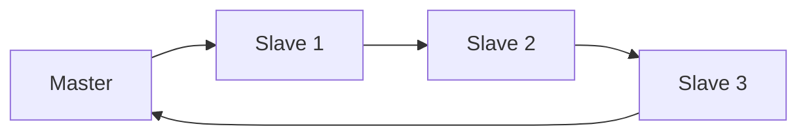
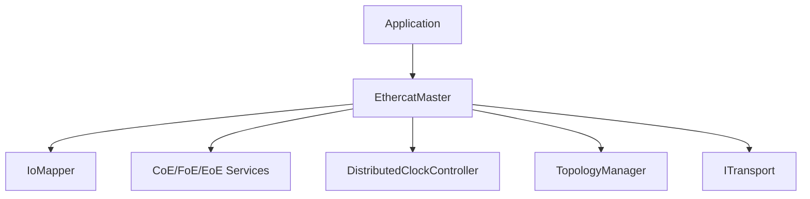
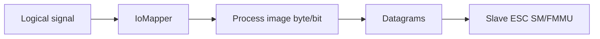
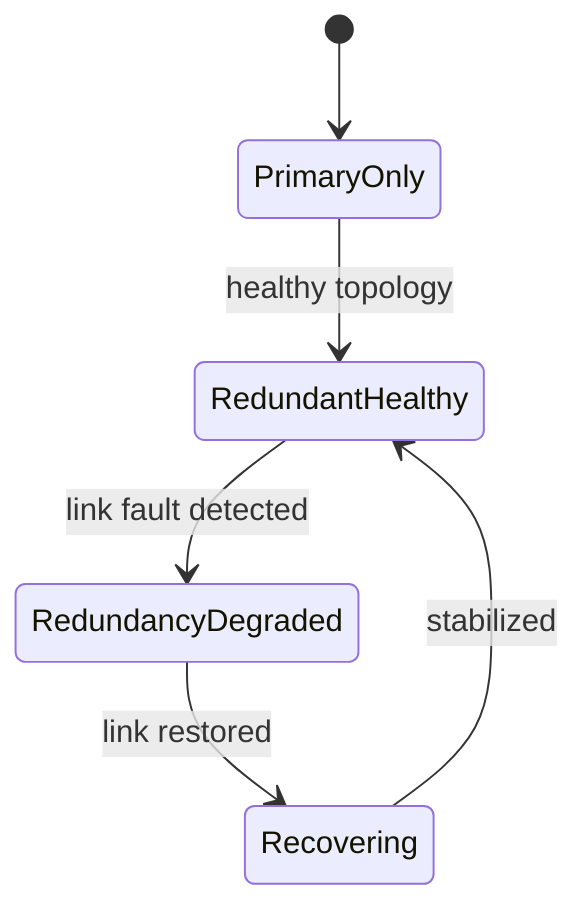

# EtherCAT for Dummies

Practical technical guide to understanding EtherCAT technology and how it maps to this openEtherCAT stack.

## Who this is for

- Software engineers building industrial communication and control software.
- Automation engineers doing EtherCAT bring-up and diagnostics.
- Anyone using this repository who wants a full protocol-to-code mental model.

## How to read this book

- Read Chapters 1-5 first if you are new to EtherCAT.
- Jump to Chapters 6-10 for implementation details.
- Use Chapters 11-13 as a bring-up and troubleshooting handbook.

---

## Chapter 1: What EtherCAT Is (and Why It Is Fast)

EtherCAT is an Ethernet-based fieldbus optimized for deterministic cyclic I/O. Its speed comes from "on-the-fly" frame processing:

- Master emits an Ethernet frame carrying EtherCAT datagrams.
- Each slave reads/writes only its mapped bytes while forwarding the frame immediately.
- The frame returns with all slave data already embedded.

This avoids per-slave request/response round trips.

### Conceptual comparison

- Traditional polling bus:
  - `Master -> Slave1`, wait, `Master -> Slave2`, wait, ...
- EtherCAT:
  - single frame traverses full line, all nodes participate in one pass.



### Determinism perspective

Determinism is achieved by combining:

- predictable cyclic scheduling on master,
- fixed process image layout,
- strict state-machine transitions,
- per-cycle datagram acknowledgements (WKC),
- optional distributed clock synchronization.

---

## Chapter 2: EtherCAT Protocol Building Blocks

At wire level, this stack uses EtherType `0x88A4` (EtherCAT Ethernet frames).

Inside an EtherCAT frame are one or more datagrams. Key commands used in this stack:

- `LWR` logical write: master writes output process image.
- `LRD` logical read: master reads input process image.
- `APRD` auto-increment physical read: read slave ESC registers/memory by station position.
- `APWR` auto-increment physical write: write slave ESC registers/memory.
- `BRD/BWR` broadcast read/write: network-wide state operations.

### Why both logical and physical access exist

- Logical access (`LWR/LRD`): high-rate cyclic process data path.
- Physical access (`APRD/APWR`): startup, diagnostics, SM/FMMU setup, AL state/status readouts.

---

## Chapter 3: Master Architecture in This Stack

`oec::EthercatMaster` is the central facade. It coordinates:

- configuration validation and mapping binding,
- startup AL transitions,
- cyclic exchange,
- mailbox services,
- diagnostics and recovery,
- distributed clocks,
- topology/redundancy supervision.



### Startup sequence (high level)

1. `configure(config)`:
- validates process image sizes and logical bindings.

2. `start()`:
- opens transport,
- transitions network through AL states,
- configures process image mapping,
- transitions to OP.

### Cyclic sequence (high level)

1. application updates outputs,
2. `runCycle()` calls transport `exchange(...)`,
3. transport performs `LWR` then `LRD`,
4. master updates input image and dispatches callbacks,
5. monitoring/policy layers may run (DC, topology, recovery).

---

## Chapter 4: Inside a Slave (ESC, AL, SM, FMMU)

A slave has an ESC (EtherCAT Slave Controller). Think of ESC as a real-time packet processor + register block.

## 4.1 AL state machine

- `INIT`: baseline initialization.
- `PRE-OP`: mailbox communication available, process data typically not active.
- `SAFE-OP`: inputs valid, outputs may be held safe.
- `OP`: full cyclic process data active.
- `BOOTSTRAP`: firmware/bootstrap mode for specialized workflows.

## 4.2 Sync Managers (SM)

SMs define memory windows and direction:

- `SM2`: usually RxPDO area (master -> slave outputs).
- `SM3`: usually TxPDO area (slave -> master inputs).

If `SM2` or `SM3` lengths are zero, PDO path may not be mapped/active.

## 4.3 FMMU

FMMU maps logical EtherCAT addresses to slave physical process RAM windows.

Practical meaning:

- Master writes logical output region.
- ESC routes to the corresponding slave output RAM area.
- Master reads logical input region.
- ESC exposes current slave input RAM area.

Without valid SM+FMMU setup, cyclic IO appears broken even if wiring is correct.

---

## Chapter 5: Process Image and Logical Mapping

Process image is the contract between control application and field bus.

- Output process image: commanded outputs.
- Input process image: measured inputs.

In this stack, logical app signals are mapped by `IoMapper`:

- `logicalName` + direction + byte/bit offsets.

### Example mapping

- `StartButton` -> input byte 0 bit N.
- `LampGreen` -> output byte 0 bit N.

Same app code can be reused across hardware changes by updating mapping, not control logic.



---

## Chapter 6: Working Counter (WKC) Correct Interpretation

WKC indicates how many addressed slave operations were accepted for a datagram.

Critical point: WKC is datagram-specific.

In this stack:

- `wkc_lwr`: WKC for output write (`LWR`).
- `wkc_lrd`: WKC for input read (`LRD`).
- `wkc_sum`: convenience sum for quick view.

### Why `wkc=1` can be correct with multiple slaves

If only one output slave participates in mapped output window and one input slave in mapped input window:

- `wkc_lwr=1`, `wkc_lrd=1` can be perfectly valid.

A coupler (e.g., EK1100) may not increment cyclic PDO WKC unless it participates in that logical datagram operation.

### Failure heuristics

- `wkc_lwr=0`: output mapping/path/state issue.
- `wkc_lrd=0`: input mapping/path/state issue.
- intermittent drops: wiring/noise/link/load/scheduling issues.

---

## Chapter 7: Mailbox Plane (CoE, FoE, EoE)

Mailbox is acyclic service traffic. It complements, not replaces, cyclic PDO flow.

## 7.1 CoE

Used for object dictionary operations:

- SDO upload/download,
- PDO assignment/mapping programming,
- emergency objects.

In this stack:

- `sdoUpload(...)`, `sdoDownload(...)`,
- `configureRxPdo(...)`, `configureTxPdo(...)`,
- emergency queue drain APIs.

## 7.2 FoE and EoE

- `FoE`: file transfer semantics (for example firmware payload flows).
- `EoE`: Ethernet-over-EtherCAT encapsulated frame path.

## 7.3 Robustness behavior implemented here

- strict mailbox response correlation,
- retry + backoff policy,
- stale/unrelated frame filtering,
- emergency frame handling during waits,
- error class counters for KPI analysis.

---

## Chapter 8: Distributed Clocks (DC) and Time Quality

Distributed clocks synchronize timing reference across slaves and master control loop.

This stack includes:

- PI correction controller,
- correction clamps and slew limiting,
- lock/loss supervision,
- out-of-window policy actions,
- runtime trace/telemetry hooks.

### Control concepts

- phase error: `referenceTime - localTime`.
- filtered error: low-pass or exponential smoothing before control action.
- correction output: bounded control effort to avoid unstable steps.

### Runtime knobs (selected)

- `OEC_DC_CLOSED_LOOP`
- `OEC_DC_KP`, `OEC_DC_KI`, `OEC_DC_FILTER_ALPHA`
- `OEC_DC_CORRECTION_CLAMP_NS`
- `OEC_DC_MAX_CORR_STEP_NS`, `OEC_DC_MAX_SLEW_NS`
- `OEC_DC_SYNC_MONITOR`, `OEC_DC_SYNC_ACTION`

### Relevant demos

- `dc_hardware_sync_demo`: focused DC register/control exploration.
- `dc_soak_demo`: long-run timing + lock/jitter KPI collection.

---

## Chapter 9: Topology Reconciliation and Change Sets

Topology is not static in production: cable faults, module swaps, power cycles, hot-connect events can happen.

This stack provides deterministic topology snapshots and deltas:

- `topologySnapshot()`
- `topologyChangeSet()`
- `topologyGeneration()`

Change set fields capture:

- `added` slaves,
- `removed` slaves,
- `updated` slave properties/state,
- redundancy health transition.

Generation gives monotonic ordering and easier event correlation.

---

## Chapter 10: Topology Policy and Redundancy Supervision

Beyond detection, production systems need policy execution.

`TopologyRecoveryOptions` supports:

- grace cycles (debounce/noise filtering),
- per-condition actions:
  - `Monitor`
  - `Retry`
  - `Reconfigure`
  - `Degrade`
  - `FailStop`

Conditions include:

- missing expected slaves,
- unexpected hot-connected slaves,
- redundancy down state.

### Redundancy states in this stack

- `PrimaryOnly`
- `RedundantHealthy`
- `RedundancyDegraded`
- `Recovering`



### Observability APIs

- `redundancyStatus()`
- `redundancyKpis()`
- `redundancyTransitions()` (timeline events)

---

## Chapter 11: Concrete API Cookbook (This Stack)

## 11.1 Master lifecycle

```cpp
oec::EthercatMaster master(*transport);
if (!master.configure(config)) {
    // inspect master.lastError()
}
if (!master.start()) {
    // inspect master.lastError()
}
while (running) {
    if (!master.runCycle()) {
        // inspect master.lastError(), recoveryEvents(), diagnostics
        break;
    }
}
master.stop();
```

## 11.2 Logical IO mapping usage

```cpp
master.onInputChange("StartButton", [&](bool state) {
    master.setOutputByName("LampGreen", state);
});
```

## 11.3 Mailbox usage

```cpp
auto wr = master.sdoDownload(2, {.index=0x2000, .subIndex=1}, {0x12, 0x34});
auto rd = master.sdoUpload(2, {.index=0x2000, .subIndex=1});
auto em = master.drainEmergencies(32);
```

## 11.4 Topology and redundancy usage

```cpp
oec::EthercatMaster::TopologyRecoveryOptions opts;
opts.enable = true;
opts.redundancyGraceCycles = 2;
opts.redundancyAction = oec::EthercatMaster::TopologyPolicyAction::Degrade;
master.setTopologyRecoveryOptions(opts);

std::string err;
if (master.refreshTopology(err)) {
    auto delta = master.topologyChangeSet();
    auto rs = master.redundancyStatus();
    auto rk = master.redundancyKpis();
    auto timeline = master.redundancyTransitions();
    (void)delta; (void)rs; (void)rk; (void)timeline;
}
```

## 11.5 DC quality usage

```cpp
auto corr = master.updateDistributedClock(referenceNs, localNs);
auto dcStats = master.distributedClockStats();
auto dcQual = master.distributedClockQuality();
```

---

## Chapter 12: Bring-Up and Troubleshooting Playbook

## 12.1 First hardware bring-up checklist

1. Scan topology and verify slave identities/states.
2. Verify process image mapping (`SM2/SM3`, FMMU traces).
3. Verify datagram-level WKC (`LWR` and `LRD` separately).
4. Verify physical output RAM readback vs command (`OEC_TRACE_OUTPUT_VERIFY`).
5. Verify field-side wiring and power if command path looks correct.

## 12.2 High-value trace knobs

- Mapping and cyclic diagnostics:
  - `OEC_TRACE_MAP=1`
  - `OEC_TRACE_WKC=1`
  - `OEC_TRACE_OUTPUT_VERIFY=1`
- DC:
  - `OEC_TRACE_DC=1`
  - `OEC_TRACE_DC_QUALITY=1`
  - `OEC_DC_QUALITY_JSON=1`
- Topology/redundancy policy:
  - `OEC_TOPOLOGY_POLICY_ENABLE=1`
  - `OEC_TOPOLOGY_*_GRACE`
  - `OEC_TOPOLOGY_*_ACTION`
  - `OEC_TOPOLOGY_REDUNDANCY_HISTORY`

## 12.3 Typical root causes

- WKC zeros:
  - AL state not OP,
  - no valid SM/FMMU mapping,
  - wrong logical offsets/sizes,
  - link issues.
- Mailbox timeouts:
  - status gating mismatch across ESC variants,
  - noisy/stale mailbox traffic,
  - insufficient timeout/backoff.
- Output appears toggled in app but not physical field:
  - field power path/wiring issues,
  - wrong channel mapping,
  - slave state not allowing output.

---

## Chapter 13: Suggested Learning and Validation Path

1. `physical_topology_scan_demo`
- understand chain composition and AL states.

2. `beckhoff_io_demo` (`mock` then Linux)
- understand mapping, callbacks, cyclic IO, and WKC semantics.

3. `mailbox_soak_demo`
- understand SDO robustness under noisy mailbox conditions.

4. `dc_hardware_sync_demo` then `dc_soak_demo`
- understand DC control behavior and KPI capture.

5. `topology_reconcile_demo` and `redundancy_fault_sequence_demo`
- understand deterministic change sets, policy execution, and transition timelines.

6. Apply `docs/runtime-determinism.md` and `docs/phase3-acceptance.md` on real hardware.

---

## Glossary

- ESC: EtherCAT Slave Controller.
- AL: Application Layer state machine.
- SM: Sync Manager windows.
- FMMU: logical-to-physical address mapping unit.
- PDO: cyclic process data object.
- CoE/SDO: mailbox object dictionary communication.
- WKC: datagram working counter.
- DC: distributed clock synchronization.

---

## Final Note

Production EtherCAT systems succeed when architecture, protocol correctness, and hardware validation are treated as one system.

This stack now gives you:

- clean and extensible C++ master architecture,
- robust mailbox/DC/topology/redundancy software mechanisms,
- and practical demos/tests/docs to move from bring-up to production validation.
