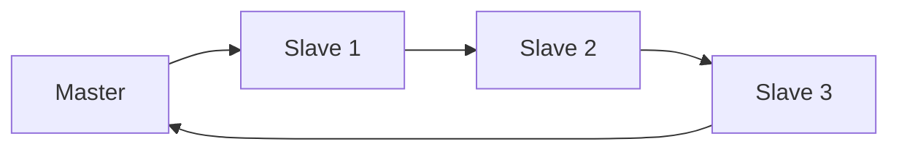
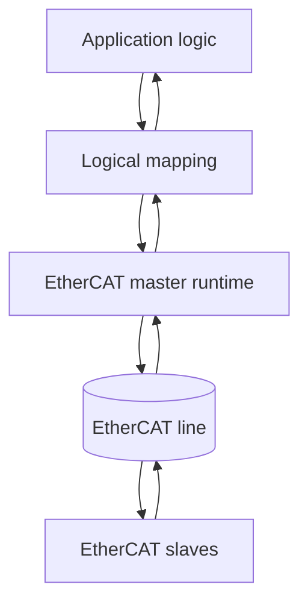
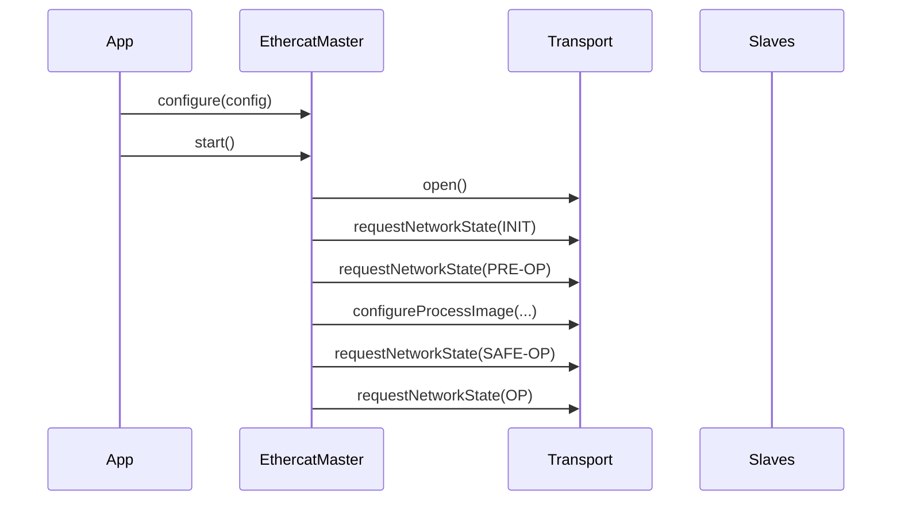
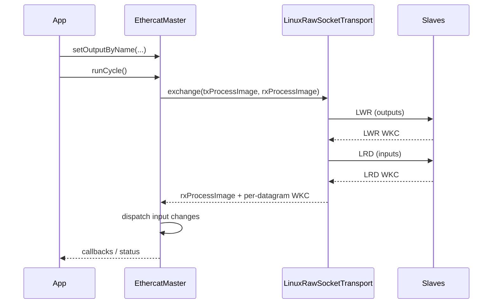
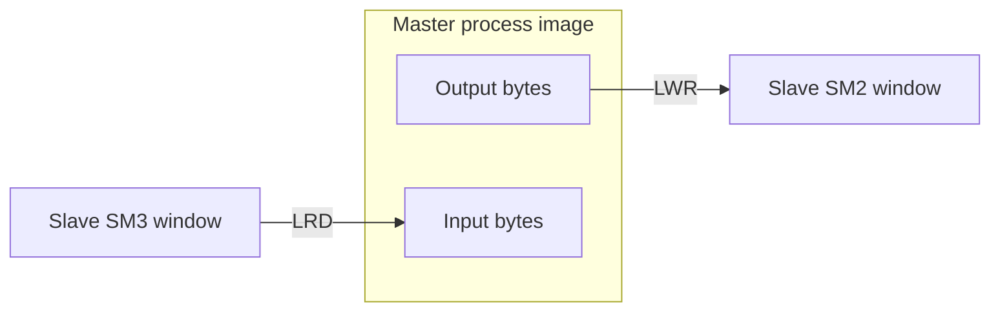
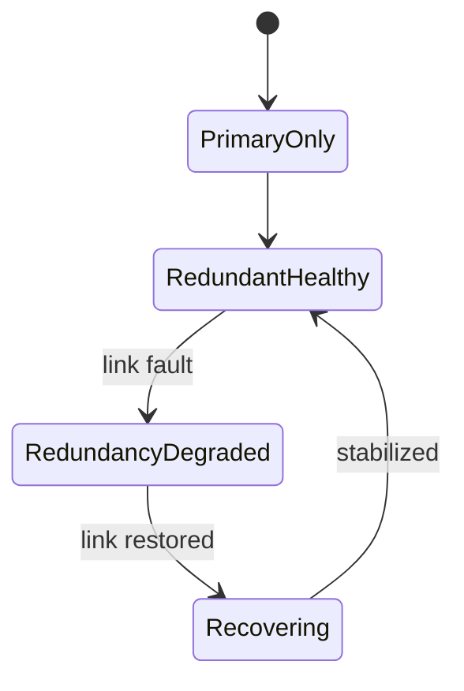

# EtherCAT for Dummies

Practical field guide to understanding EtherCAT technology and how it maps to this openEtherCAT stack.

## Who this is for

- Software engineers building controls and industrial communication systems.
- Automation engineers who want to understand what the master and slaves are doing internally.
- Anyone using this repository and wanting a single end-to-end mental model.

## What this book covers

1. EtherCAT in plain words.
2. What happens inside the master.
3. What happens inside a slave (ESC, SM, FMMU, AL state machine).
4. Process data, mailbox traffic, and working counters.
5. Distributed clocks, topology, and redundancy.
6. How all of this maps directly to the openEtherCAT stack in this repo.

---

## Chapter 1: EtherCAT in One Minute

EtherCAT is an Ethernet-based fieldbus optimized for deterministic cyclic I/O.

Core idea:
- The master sends one frame.
- Every slave reads/writes "its bytes" while the frame is passing through.
- The frame returns quickly with all updates done.

Compared to classic request/response bus patterns, this is very efficient and low-latency for real-time control.



---

## Chapter 2: Big Picture Architecture

At runtime there are two worlds:

- Application world:
  - your logical signals like `StartButton`, `LampGreen`, drive setpoints, status flags.
- EtherCAT world:
  - bytes and bits in process images and mailbox objects.

The stack bridges those worlds.



---

## Chapter 3: EtherCAT Master Side

The master has two jobs:

1. Startup/configuration:
- Discover and validate expected chain.
- Transition AL states (INIT -> PRE-OP -> SAFE-OP -> OP).
- Configure process image mapping.

2. Cyclic operation:
- Write outputs to slaves.
- Read inputs from slaves.
- Dispatch application callbacks.
- Monitor errors and recover.

In this stack, this is orchestrated by `oec::EthercatMaster`.

### Master startup flow



### Master cyclic flow



---

## Chapter 4: EtherCAT Slave Side (What a Slave Actually Does)

A slave contains an ESC (EtherCAT Slave Controller).

Important ESC pieces:
- AL state machine:
  - INIT, PRE-OP, SAFE-OP, OP.
- Sync Managers (SM):
  - SM2 typically output PDO area (master -> slave).
  - SM3 typically input PDO area (slave -> master).
- FMMU:
  - maps logical master addresses to physical ESC memory windows.
- Mailbox channels:
  - CoE/FoE/EoE acyclic communication.

### AL states in practice

- INIT:
  - basic initialization.
- PRE-OP:
  - mailbox communication for configuration.
- SAFE-OP:
  - inputs valid; outputs often held safe.
- OP:
  - full cyclic data exchange active.

### Why SM and FMMU matter

- SM defines where process data lives inside the slave.
- FMMU maps those windows into the master logical process image.
- Without valid SM/FMMU mapping, cyclic datagrams can produce zero WKC.

---

## Chapter 5: Process Image (The Most Important Concept)

Think of process image as shared cyclic byte arrays:

- Output process image:
  - command bytes from application to field.
- Input process image:
  - status bytes from field to application.

In this stack:
- `LWR` writes output image region.
- `LRD` reads input image region.



For simple digital terminals:
- one byte can represent several channels.
- bit offsets map channels (`bit0` -> CH1, etc.).

---

## Chapter 6: Working Counter (WKC) Without Confusion

WKC tells how many addressed operations were accepted/processed by slaves for that datagram.

Key rule:
- Interpret WKC per datagram.

In this stack:
- `wkc_lwr` is output write datagram WKC.
- `wkc_lrd` is input read datagram WKC.
- `wkc_sum = wkc_lwr + wkc_lrd` is a convenience number, not a protocol field.

Important nuance:
- A coupler like EK1100 does not necessarily increment cyclic PDO WKC unless it participates in that logical mapping.
- So with one output terminal and one input terminal, it is normal to see:
  - `wkc_lwr=1`, `wkc_lrd=1`.

---

## Chapter 7: Mailbox Protocols (CoE/FoE/EoE)

Cyclic PDO traffic is for real-time data.
Mailbox traffic is for acyclic services:

- CoE:
  - SDO upload/download, PDO assignment/configuration, emergency objects.
- FoE:
  - file transfer (for example firmware workflows).
- EoE:
  - Ethernet over EtherCAT tunneling.

In this stack:
- `sdoUpload`, `sdoDownload`, `configureRxPdo`, `configureTxPdo`.
- emergency queue drain API.
- FoE/EoE service APIs.

Robustness features implemented include:
- strict response matching (index/subindex/toggle/counter checks),
- retry/backoff,
- stale frame filtering,
- diagnostics counters.

---

## Chapter 8: Distributed Clocks (DC)

DC aligns timing across distributed slaves for deterministic phase behavior.

The stack includes:
- PI controller for correction.
- quality monitor with lock/loss tracking and jitter stats.
- policy actions on out-of-window conditions.

Runtime knobs include:
- `OEC_DC_CLOSED_LOOP`
- `OEC_DC_KP`, `OEC_DC_KI`
- `OEC_DC_MAX_CORR_STEP_NS`, `OEC_DC_MAX_SLEW_NS`
- `OEC_DC_SYNC_MONITOR`, `OEC_DC_SYNC_ACTION`

Use:
- `dc_hardware_sync_demo` for focused DC behavior.
- `dc_soak_demo` for longer KPI collection.

---

## Chapter 9: Topology, Hot-Connect, and Redundancy

Topology handling has two levels:

1. Snapshot + diff:
- current discovered slaves
- deterministic change sets (`added/removed/updated`)
- generation counter

2. Policy execution:
- grace cycles
- actions (`monitor`, `retry`, `reconfigure`, `degrade`, `failstop`)
- latching (avoid repeated triggers during sustained faults)

Redundancy observability:
- current redundancy state
- KPI counters/latencies
- transition timeline history



---

## Chapter 10: How This Maps to Your Stack (Concrete API)

### Core runtime

```cpp
oec::EthercatMaster master(*transport);
master.configure(config);
master.start();
while (running) {
    master.runCycle();
}
master.stop();
```

### Logical signal mapping

```cpp
master.onInputChange("StartButton", [&](bool s) {
    master.setOutputByName("LampGreen", s);
});
```

### Mailbox services

```cpp
auto wr = master.sdoDownload(2, {.index=0x2000, .subIndex=1}, {0x12, 0x34});
auto rd = master.sdoUpload(2, {.index=0x2000, .subIndex=1});
```

### Topology and redundancy

```cpp
std::string err;
if (master.refreshTopology(err)) {
    auto delta = master.topologyChangeSet();
    auto rs = master.redundancyStatus();
    auto rk = master.redundancyKpis();
    auto timeline = master.redundancyTransitions();
    (void)delta; (void)rs; (void)rk; (void)timeline;
}
```

---

## Chapter 11: Common Bring-up Mistakes

1. Treating one WKC number as "total bus health":
- always inspect per datagram (`LWR` vs `LRD`).

2. Assuming every slave increments cyclic WKC:
- only slaves that process that datagram contribute.

3. Forgetting AL state readiness:
- PRE-OP/SAFE-OP/OP transitions matter.

4. Ignoring power/wiring reality:
- process RAM may update while output field power path is missing.

5. Mixing cyclic and mailbox expectations:
- PDO and mailbox flows have different timing/semantics.

---

## Chapter 12: Practical Learning Path

Run these in order:

1. `physical_topology_scan_demo`
- identify slaves and AL states.

2. `beckhoff_io_demo` in mock and then Linux mode.
- understand logical mapping and cyclic flow.

3. `mailbox_soak_demo`
- understand mailbox robustness and diagnostics.

4. `dc_hardware_sync_demo` then `dc_soak_demo`
- understand timing control and quality KPIs.

5. `topology_reconcile_demo` and `redundancy_fault_sequence_demo`
- understand phase-3 topology/redundancy behavior.

---

## Glossary

- ESC: EtherCAT Slave Controller.
- AL: Application Layer state machine.
- SM: Sync Manager process/mailbox windows.
- FMMU: logical-to-physical memory mapping unit.
- PDO: cyclic process data object.
- CoE/SDO: acyclic object dictionary service.
- WKC: working counter per datagram.
- DC: distributed clocks synchronization.

---

## Final Note

EtherCAT mastery comes from combining:
- protocol-level understanding,
- deterministic software design,
- and disciplined hardware validation.

This stack gives you all three building blocks:
- clean C++ architecture,
- production-hardening hooks,
- and practical demos/tests for iterative learning.
