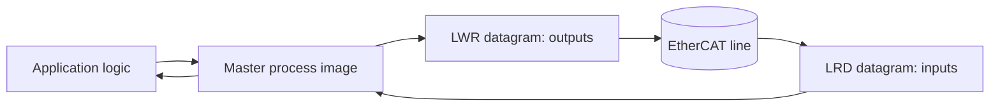
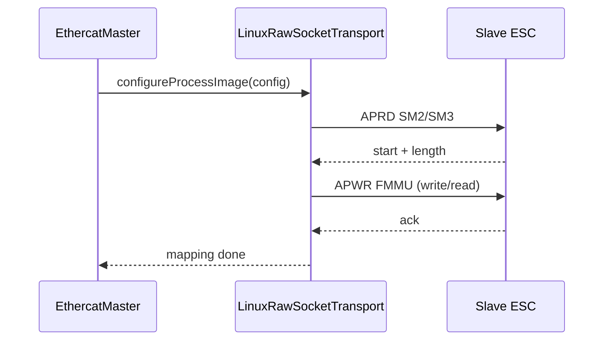
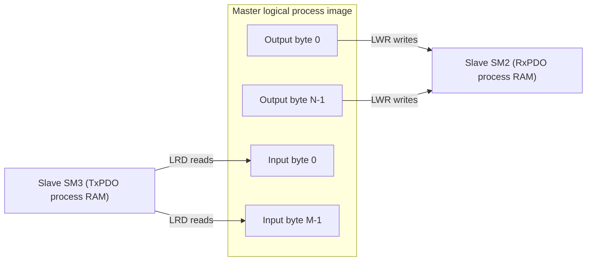
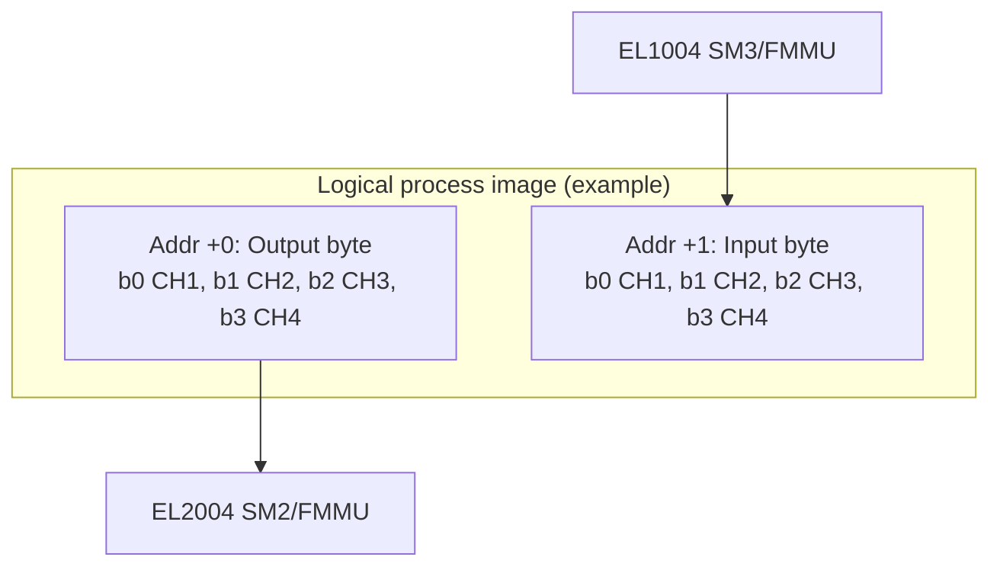

# EtherCAT Primer and Trace Guide

This document explains the core EtherCAT terms used across this stack and how to interpret runtime traces during bring-up.

## 1) EtherCAT data path in one view



## 2) Core abbreviations

| Term | Full name | What it means | Why it matters |
|---|---|---|---|
| `ESC` | EtherCAT Slave Controller | ASIC/FPGA in each slave terminal. | Implements EtherCAT registers, SMs, FMMUs, AL states. |
| `AL` | Application Layer | EtherCAT slave state machine (INIT/PRE-OP/SAFE-OP/OP/BOOT). | Startup and fault recovery depend on AL state and AL status code. |
| `SM` | Sync Manager | ESC mailbox/process-data windows. | `SM2` is typically output PDO window; `SM3` is typically input PDO window. |
| `SM2` | Sync Manager 2 | Output process data window (master -> slave). | If `SM2` length is zero, outputs are not mapped yet. |
| `SM3` | Sync Manager 3 | Input process data window (slave -> master). | If `SM3` length is zero, inputs are not mapped yet. |
| `FMMU` | Fieldbus Memory Management Unit | Maps slave physical ESC memory windows to master logical addresses. | Enables logical process-image access with EtherCAT logical addressing. |
| `PDO` | Process Data Object | Cyclic I/O data objects. | Carries real-time bits/bytes such as digital input/output channels. |
| `TxPDO` | Transmit PDO | Data transmitted by slave (to master). | Usually mapped into `SM3`. |
| `RxPDO` | Receive PDO | Data received by slave (from master). | Usually mapped into `SM2`. |
| `CoE` | CANopen over EtherCAT | Mailbox protocol used for SDO/PDO config and object dictionary access. | Used for advanced configuration, diagnostics, and parameterization. |
| `SDO` | Service Data Object | Acyclic object dictionary read/write. | Used for setup (indexes like `0x1600`, `0x1A00`, `0x1018`). |
| `APRD` | Auto Increment Physical Read | Read ESC register/memory by position (`ADP` auto-inc addressing). | Used to read SM/FMMU/AL state and process RAM for diagnostics. |
| `APWR` | Auto Increment Physical Write | Write ESC register/memory by position. | Used to configure SM/FMMU and state control registers. |
| `LWR` | Logical Write | Writes master output process image to mapped slaves. | Cyclic output update command. |
| `LRD` | Logical Read | Reads slave input process image into master buffer. | Cyclic input acquisition command. |
| `LRW` | Logical Read Write | Combined read/write logical datagram. | Not required; this stack currently uses split `LWR` + `LRD`. |
| `WKC` | Working Counter | Number of slave operations that acknowledged/processed a datagram. | First-line health signal for mapping and cyclic data validity. |

## 3) How this stack maps process data

During `EthercatMaster::start()`:

1. Transition to PRE-OP.
2. `LinuxRawSocketTransport::configureProcessImage(...)` runs.
3. Read `SM2` (outputs) and `SM3` (inputs) start/length for each configured I/O slave.
4. Program FMMU entries.
5. Output FMMU maps to master logical output region.
6. Input FMMU maps to master logical input region.
7. Transition to SAFE-OP and OP.



## 3.1) Process image structure (logical layout)

In this stack, the logical process image is split into:

- Output region first (`config.processImageOutputBytes`)
- Input region second (`config.processImageInputBytes`)

The transport uses:

- `LWR` at `logicalAddress` for the output region.
- `LRD` at `logicalAddress + outputBytes` for the input region.



### Example: EK1100 + EL1004 + EL2004 (4-channel digital I/O)

With `processImageOutputBytes=1` and `processImageInputBytes=1`:

- Logical output byte 0:
- bit0..bit3 -> EL2004 channels 1..4 (for demo signal `LampGreen`, selected channel decides bit offset).
- Logical input byte 0:
- bit0..bit3 -> EL1004 channels 1..4 (for demo signal `StartButton`, selected channel decides bit offset).



## 4) How to interpret WKC in this implementation

This stack uses split cyclic datagrams:

- One `LWR` for outputs.
- One `LRD` for inputs.

So you should interpret WKC per datagram, not as one combined LRW number.

Example:

```text
[oec] LWR wkc=1
[oec] LRD wkc=1
```

For one output slave and one input slave, this is often expected.

Common WKC interpretations:

- `wkc=0` on `LWR`: output mapping/path is not participating (mapping/state/link issue).
- `wkc=0` on `LRD`: input mapping/path is not participating.
- WKC drops intermittently: cable/contact/noise/redundancy failover/load timing issue.

## 5) Bring-up trace flags

Use these environment variables when running Linux transport examples:

- `OEC_TRACE_MAP=1`: prints startup SM/FMMU mapping details.
- `OEC_TRACE_WKC=1`: prints cyclic WKC for each `LWR`/`LRD`.
- `OEC_TRACE_OUTPUT_VERIFY=1`: reads back output process RAM from mapped `SM2` windows (via `APRD`), compares bytes against commanded output process-image bytes, and helps separate "master sent wrong data" from "output stage/power/wiring is not driving field signal."
- `OEC_MAILBOX_RETRIES=<N>`: retry count for transient mailbox datagram failures (default `2`).
- `OEC_MAILBOX_BACKOFF_BASE_MS=<ms>`: base delay for mailbox retry backoff (default `1` ms).
- `OEC_MAILBOX_BACKOFF_MAX_MS=<ms>`: cap for mailbox retry backoff (default `20` ms).
- `OEC_MAILBOX_STATUS_MODE=strict|hybrid|poll`: mailbox status-bit handling mode (default `hybrid`).
- `OEC_MAILBOX_EMERGENCY_QUEUE_LIMIT=<N>`: maximum queued CoE emergency messages before oldest-drop (default `256`).
- `OEC_SOAK_JSON=1`: for `mailbox_soak_demo`, emits JSON-lines progress/diagnostics suitable for CI KPI ingestion.

Mailbox robustness behavior in current Linux transport:

- SDO responses are correlated by mailbox counter plus SDO context (address/toggle).
- Unrelated CoE mailbox frames are ignored while waiting for the matching response.
- CoE emergency frames observed during SDO waits are queued for later retrieval via `pollEmergency(...)`.
- `strict` mode enforces SM status availability/readiness before mailbox transfer.
- `poll` mode skips status-bit gating and relies on mailbox polling cadence.
- Mailbox diagnostics include error-class counters (`timeout`, `busy`, `parse`, `stale_counter`, `abort`, `transport_io`, `unknown`) for KPI analysis.
- Mailbox diagnostics output includes `schema_version` for stable machine parsing across CI/report pipelines.

Typical command:

```bash
sudo OEC_TRACE_MAP=1 OEC_TRACE_WKC=1 OEC_TRACE_OUTPUT_VERIFY=1 \
  ./build/beckhoff_io_demo linux:enp2s0
```

## 6) AL states and quick meaning

| AL state | Meaning |
|---|---|
| `INIT` | Basic initialization only, no process data. |
| `PRE-OP` | Mailbox/configuration phase; process data usually not active. |
| `SAFE-OP` | Input process data valid; outputs typically held safe. |
| `OP` | Full cyclic I/O active. |
| `BOOTSTRAP` | Firmware/bootstrap mode. |

If a slave stays in `INIT` while others are `PRE-OP/OP`, suspect power state, configuration mismatch, or terminal readiness.

## 7) Typical digital I/O terminal expectations

For simple terminals (for example EL1004/EL2004 style):

- Process image is often byte-packed channel bits.
- Channel 1 usually maps to bit 0, channel 2 to bit 1, and so on.
- `SM2`/`SM3` lengths are often `1` byte for 4-channel digital I/O terminals.

If you remap channel selection in application config, verify byte/bit offsets match your actual wiring.

## 8) Practical debugging checklist

1. Confirm slave count and product codes with `physical_topology_scan_demo`.
2. Confirm each slave reaches expected AL state.
3. Enable `OEC_TRACE_MAP=1` and verify non-zero `SM2`/`SM3` lengths.
4. Enable `OEC_TRACE_WKC=1` and ensure `LWR`/`LRD` WKC are non-zero.
5. Enable `OEC_TRACE_OUTPUT_VERIFY=1` and check "output image matches".
6. If RAM matches but field signal does not, inspect terminal/channel wiring and 24V field power path.

## 9) DC prototype runtime knobs

For `dc_hardware_sync_demo`:

- `OEC_DC_SOAK_JSON=1`: emits JSON-lines progress and diagnostics.
- `OEC_DC_MAX_CORR_STEP_NS=<N>`: absolute limit for applied DC offset correction per sample.
- `OEC_DC_MAX_SLEW_NS=<N>`: max change between consecutive applied corrections (slew limiter).

These limits help avoid aggressive correction steps while validating DC behavior on real hardware.

For optional in-master closed-loop DC inside `EthercatMaster::runCycle`:

- `OEC_DC_CLOSED_LOOP=1`: enable in-master DC loop.
- `OEC_DC_REFERENCE_SLAVE=<pos>`: slave position used as DC reference (default `1`).
- `OEC_DC_TARGET_PHASE_NS=<ns>`: optional host-vs-reference phase shift target.
- `OEC_DC_FILTER_ALPHA=<0..1>`: PI input filtering alpha.
- `OEC_DC_KP=<gain>` / `OEC_DC_KI=<gain>`: controller gains.
- `OEC_DC_CORRECTION_CLAMP_NS=<ns>`: PI correction output clamp.
- `OEC_DC_MAX_CORR_STEP_NS=<ns>`: per-cycle absolute correction limit.
- `OEC_DC_MAX_SLEW_NS=<ns>`: per-cycle slew limit between applied corrections.

For DC sync quality supervision and policy actions:

- `OEC_DC_SYNC_MONITOR=1`: enable per-cycle phase-error quality monitor.
- `OEC_DC_SYNC_MAX_PHASE_ERROR_NS=<ns>`: in-window threshold for lock quality.
- `OEC_DC_SYNC_LOCK_ACQUIRE_CYCLES=<N>`: consecutive in-window cycles required for lock.
- `OEC_DC_SYNC_MAX_OOW_CYCLES=<N>`: consecutive out-of-window cycles before policy trigger.
- `OEC_DC_SYNC_HISTORY_WINDOW=<N>`: rolling sample window for jitter percentiles.
- `OEC_DC_SYNC_ACTION=warn|degrade|recover`: policy when out-of-window threshold is exceeded.

Debug visibility knobs:

- `OEC_TRACE_DC=1`: emit per-cycle DC trace from master closed-loop path (`ref_ns`, `host_ns`, `phase_err_ns`, raw/applied correction, lock transition).
- `OEC_TRACE_DC_QUALITY=1`: emit periodic DC quality snapshots in `beckhoff_io_demo`.
- `OEC_DC_QUALITY_JSON=1`: format `beckhoff_io_demo` DC quality snapshots as JSON lines.
