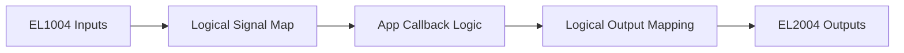
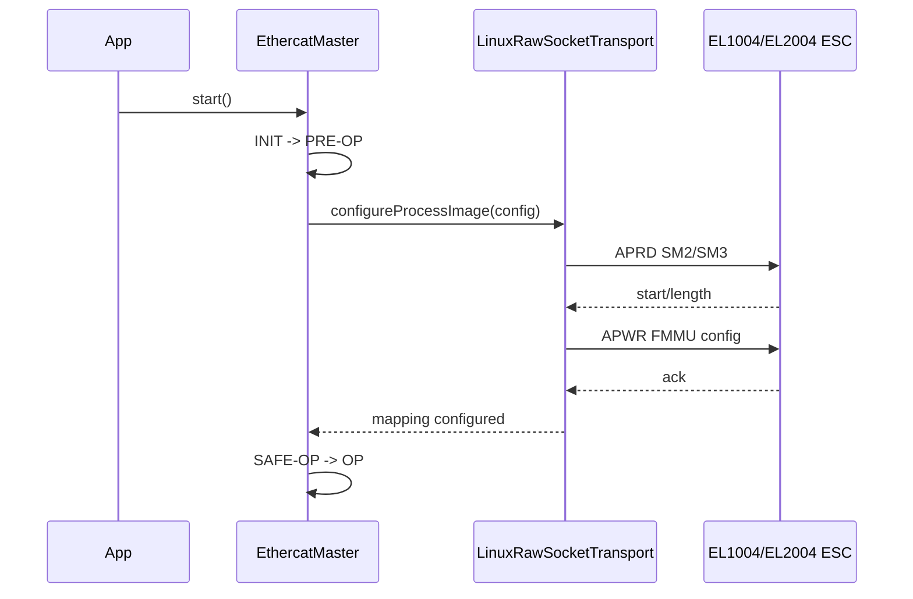
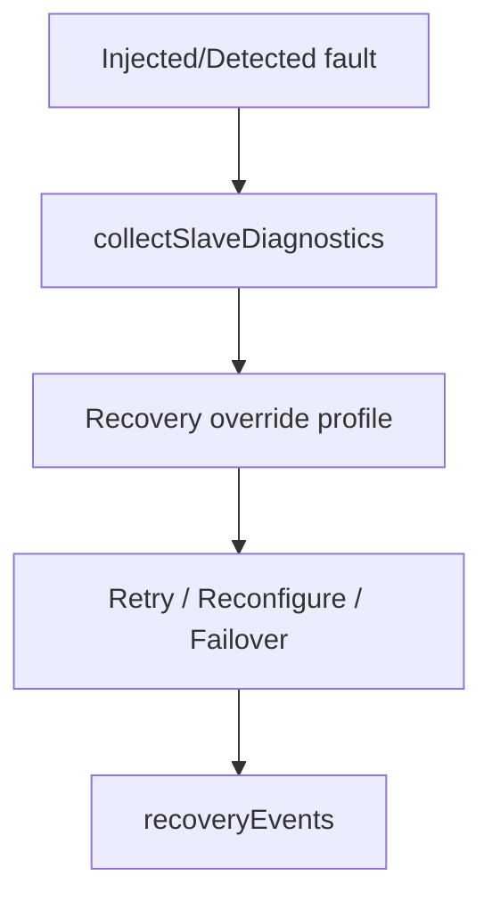
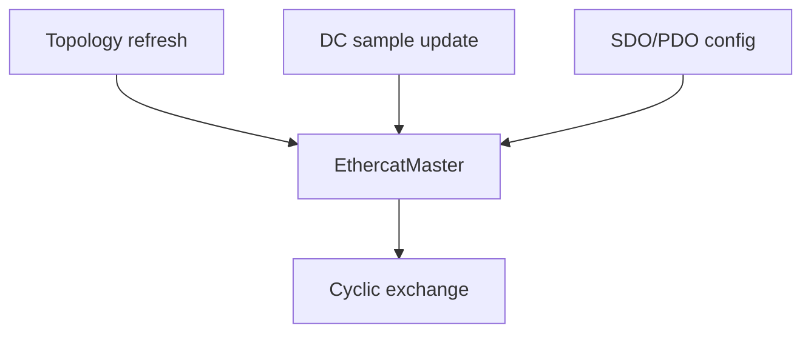
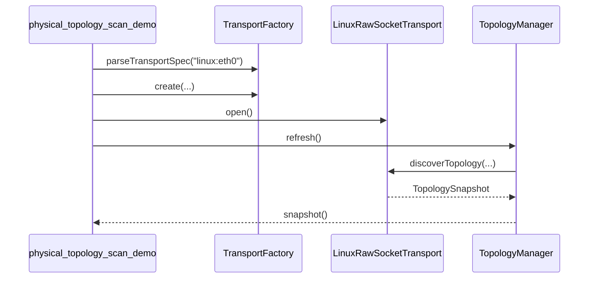
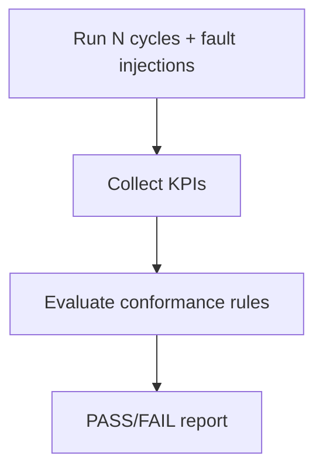
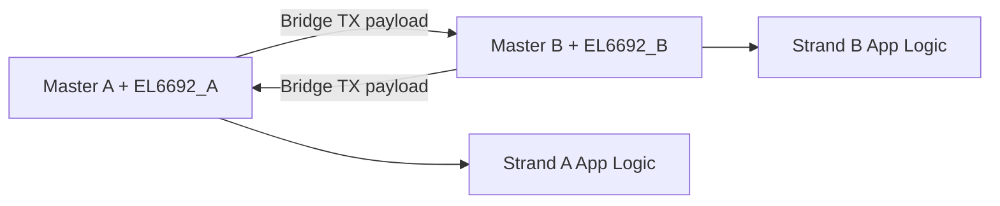
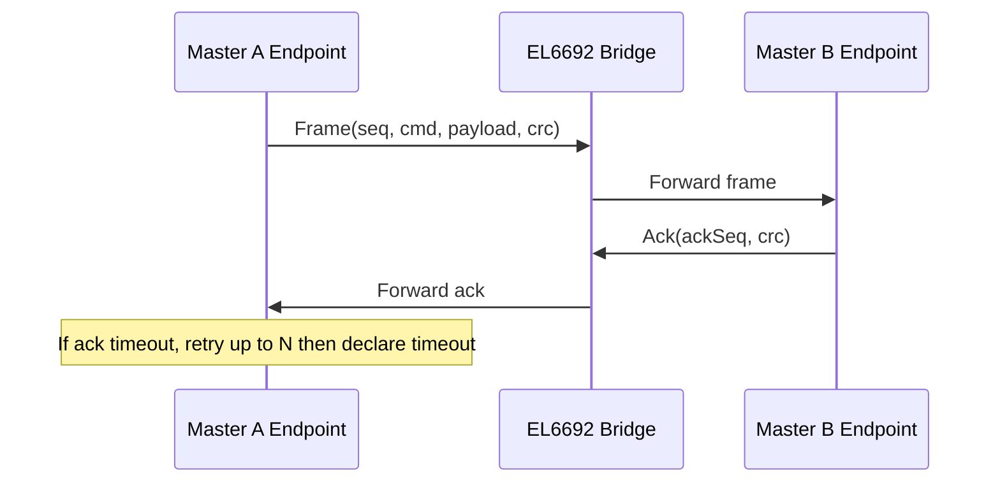
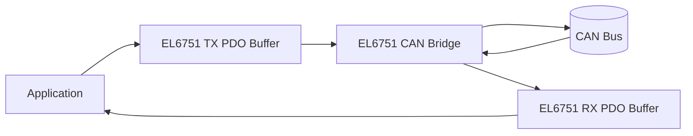
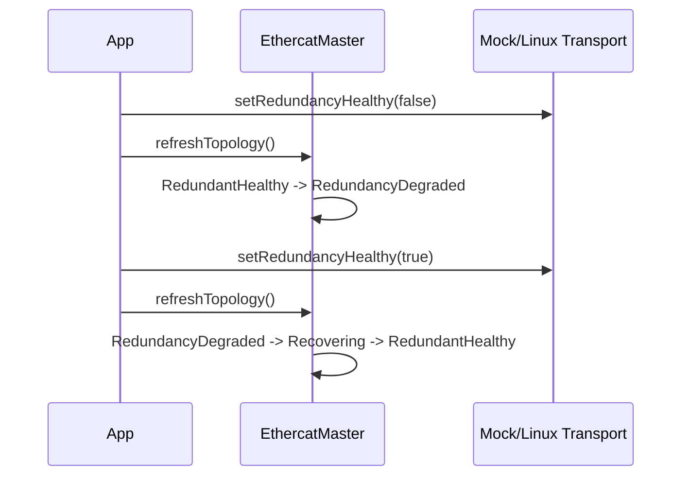

# Use Cases

## 1) Simple digital I/O station (EK1100 + EL1004 + EL2004)



Reference example: `examples/beckhoff_io_demo.cpp`.

Class responsibility mapping:
- `ConfigurationLoader`: loads ENI/ESI configuration and signal bindings.
- `TransportFactory`: selects `MockTransport` or `LinuxRawSocketTransport`.
- `EthercatMaster`: orchestrates startup, cyclic exchange, and callback dispatch.
- `IoMapper` (inside master): resolves `StartButton` and `LampGreen`.

Startup mapping notes for Linux transport:
- `EthercatMaster::start()` transitions network to PRE-OP first.
- `LinuxRawSocketTransport::configureProcessImage(...)` reads SM2/SM3 from each configured I/O slave.
- Transport programs FMMU windows for output (SM2/write) and input (SM3/read) paths.
- Then startup continues to SAFE-OP and OP.
- For field troubleshooting, set `OEC_TRACE_MAP=1` to print SM/FMMU startup mapping.
- For field troubleshooting, set `OEC_TRACE_WKC=1` to print cyclic WKC per datagram.
- For field troubleshooting, set `OEC_TRACE_OUTPUT_VERIFY=1` to read back SM2 RAM and compare commanded output bytes.



```cpp
oec::TransportFactoryConfig tc;
tc.mockInputBytes = config.processImageInputBytes;
tc.mockOutputBytes = config.processImageOutputBytes;
oec::TransportFactory::parseTransportSpec("linux:eth0", tc, error);
auto transport = oec::TransportFactory::create(tc, error);

oec::EthercatMaster master(*transport);
master.configure(config);
master.onInputChange("StartButton", [&](bool pressed) {
    master.setOutputByName("LampGreen", pressed);
});
master.start();
```

## 2) Recovery diagnostics and profile-driven policy



Reference examples:
- `examples/recovery_diagnostics_demo.cpp`
- `examples/recovery_profile_demo.cpp`

Class responsibility mapping:
- `EthercatMaster`: collects diagnostics and applies recovery path.
- `SlaveDiagnostics` + AL status mapping: translates low-level fault state into semantic diagnostics.
- Recovery policy loader/profile: chooses `RetryTransition`, `Reconfigure`, or `Failover`.

```cpp
const auto diagnostics = master.collectSlaveDiagnostics();
for (const auto& d : diagnostics) {
    // d.identity.position, d.state, d.alStatusCode
}
if (!master.runCycle()) {
    // master handles policy-driven recovery; inspect master.recoveryEvents()
}
```

## 3) Topology + DC + mailbox service integration



Reference example: `examples/coe_dc_topology_demo.cpp`.

Class responsibility mapping:
- `TopologyManager`: discovers online slaves and redundancy state.
- `DistributedClockController`: computes correction from cycle time samples.
- `CoeMailboxService` (via `EthercatMaster`): performs SDO/PDO operations.

```cpp
std::string topoErr;
if (master.refreshTopology(topoErr)) {
    const auto snap = master.topologySnapshot();
    const auto delta = master.topologyChangeSet();
    const auto rs = master.redundancyStatus();
    const auto rk = master.redundancyKpis();
    (void)delta; (void)rs; (void)rk;
}
const auto corr = master.updateDistributedClock(refNs, localNs);
const auto sdo = master.sdoUpload(2, {.index = 0x2000, .subIndex = 1});
```

## 4) Physical topology scan utility



Reference example: `examples/physical_topology_scan_demo.cpp`.

Class responsibility mapping:
- `TransportFactory`: creates Linux transport from CLI transport spec.
- `LinuxRawSocketTransport`: probes slave AL state/vendor/product identity.
- `TopologyManager`: owns current scan snapshot and exposes it to app layer.

```cpp
oec::TransportFactoryConfig tc;
oec::TransportFactory::parseTransportSpec("linux:eth0", tc, error);
auto transport = oec::TransportFactory::create(tc, error);
transport->open();

oec::TopologyManager topology(*transport);
topology.refresh(error);
const auto snap = topology.snapshot();
transport->close();
```

## 5) Long-run HIL-style campaign



Reference examples:
- `examples/mock_hil_soak.cpp`
- `examples/hil_conformance_demo.cpp`

Class responsibility mapping:
- `MockTransport`: deterministic fault injection and repeatable test conditions.
- `EthercatMaster`: executes cycles and records failure/recovery counters.
- `HilCampaignEvaluator`: evaluates KPIs against conformance thresholds.

```cpp
for (std::size_t i = 0; i < cycles; ++i) {
    const bool ok = master.runCycle();
    (void)ok;
}
const auto report = master.evaluateHilConformance(0.01, 500.0, 100, observedP99Us);
```

## 6) EL6692 master bridge pattern (dual strand data exchange)



Reference example: `examples/el6692_bridge_demo.cpp`.

The example demonstrates cyclic payload exchange over a simulated EL6692 bridge data area
using two independent EtherCAT master instances and two process images.

Class responsibility mapping:
- Two `EthercatMaster` instances: one per strand/domain.
- Two `MockTransport` instances: simulate opposite EL6692 sides.
- Bridge adapter logic in example: copies data-area payload between strands.

## 7) EL6692 structured bridge protocol (CRC + seq/ack + retry/timeout)



Reference example: `examples/el6692_structured_bridge_demo.cpp`.

Class responsibility mapping:
- Endpoint protocol class in example: frame format, sequence/ack, CRC.
- Two master/transport pairs: cyclic transport of protocol frames.
- App logic: timeout and retry policy on top of cyclic EtherCAT process image.

## 8) EL6751 CAN bridge pattern



Reference example: `examples/el6751_can_bridge_demo.cpp`.

The example demonstrates packing/unpacking CAN frames into process-image regions, status bit handling,
and cyclic transfer behavior through a simulated EL6751 bridge path.

Class responsibility mapping:
- `EthercatMaster`/`IoMapper`: map logical CAN fields to PDO bytes/bits.
- EL6751 bridge adapter logic in example: marshals CAN frame ID/DLC/payload to process image.
- Optional `MockTransport` second strand: simulated CAN bus side endpoint.

## Transport selection pattern across examples

All updated examples can use runtime transport specification:
- `mock`
- `linux:<ifname>`
- `linux:<ifname_primary>,<ifname_secondary>`

```cpp
oec::TransportFactoryConfig tc;
tc.mockInputBytes = cfg.processImageInputBytes;
tc.mockOutputBytes = cfg.processImageOutputBytes;
if (!oec::TransportFactory::parseTransportSpec(spec, tc, err)) {
    // invalid format
}
auto transport = oec::TransportFactory::create(tc, err);
```

## 9) Redundancy fault-sequence campaign



Reference example: `examples/redundancy_fault_sequence_demo.cpp`.

Class responsibility mapping:
- `EthercatMaster`: state transition timeline + KPI accumulation.
- Topology recovery policy: grace-cycle action triggering and latching.
- Transport: fault injection (`redundancyHealthy`) and discovery snapshot.

```cpp
oec::EthercatMaster::TopologyRecoveryOptions opts;
opts.enable = true;
opts.redundancyGraceCycles = 2;
opts.redundancyAction = oec::EthercatMaster::TopologyPolicyAction::Degrade;
master.setTopologyRecoveryOptions(opts);

std::string err;
master.refreshTopology(err);
const auto timeline = master.redundancyTransitions();
const auto kpi = master.redundancyKpis();
```
