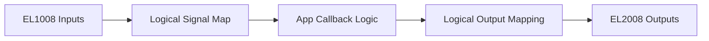
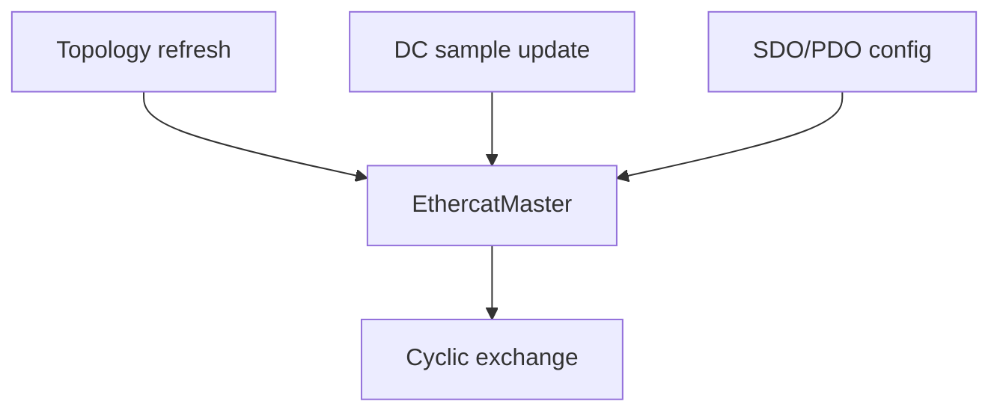
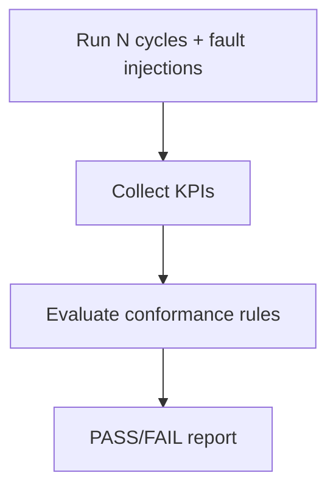
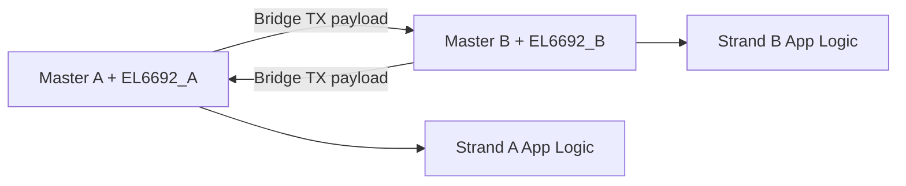
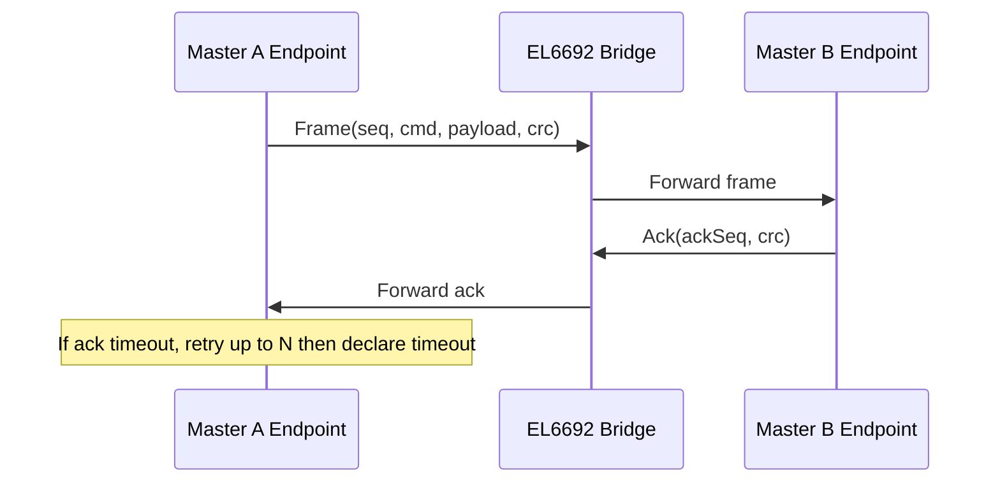
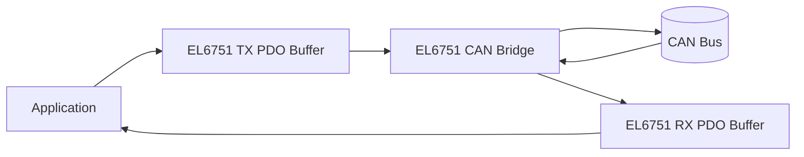

# Use Cases

## 1) Simple digital I/O station (EK1100 + EL1008 + EL2008)



Reference example: `examples/beckhoff_io_demo.cpp`.

## 2) Recovery diagnostics and profile-driven policy

```mermaid
flowchart TD
    Fault[Injected/Detected fault] --> Diagnostics[collectSlaveDiagnostics()]
    Diagnostics --> Profile[Recovery override profile]
    Profile --> Action[Retry / Reconfigure / Failover]
    Action --> History[recoveryEvents()]
```

Reference examples:
- `examples/recovery_diagnostics_demo.cpp`
- `examples/recovery_profile_demo.cpp`

## 3) Topology + DC + mailbox service integration



Reference example: `examples/coe_dc_topology_demo.cpp`.

## 4) Long-run HIL-style campaign



Reference examples:
- `examples/mock_hil_soak.cpp`
- `examples/hil_conformance_demo.cpp`

## 5) EL6692 master bridge pattern (dual strand data exchange)



Reference example: `examples/el6692_bridge_demo.cpp`.

The example demonstrates cyclic payload exchange over a simulated EL6692 bridge data area
using two independent EtherCAT master instances and two process images.

## 6) EL6692 structured bridge protocol (CRC + seq/ack + retry/timeout)



Reference example: `examples/el6692_structured_bridge_demo.cpp`.

## 7) EL6751 CAN bridge pattern



Reference example: `examples/el6751_can_bridge_demo.cpp`.

The example demonstrates packing/unpacking CAN frames into process-image regions, status bit handling,
and cyclic transfer behavior through a simulated EL6751 bridge path.
